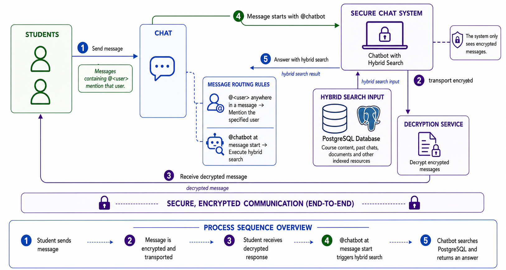

# []()Definition of a system for an interactive exam preparation application (WEB) with the help of AI concepts and algorithms

*Harald Glab-Plhak, mailto:**[hglabplhak@icloud.com](mailto:hglabplhak@icloud.com),*

(c) Harald Glab.Plhak

***Harald Glab-Plhak – staatlich geprüfter Informatiker (GER)***

**Table of Contents**

[Definition of a system for an interactive exam preparation application (WEB) with the help of AI concepts and algorithms 1](#__RefHeading___Toc2690_1309138682)

[1 Introduction 2](#__RefHeading___Toc80318_1497012155)

[1.1 Short overview 2](#__RefHeading___Toc72186_1497012155)

[1.2 The problem 2](#__RefHeading___Toc74041_1497012155)

[1.3 The way to solve the problem 3](#__RefHeading___Toc4867_4102966944)

[2 An example of AI in education and the preparation of exams 3](#__RefHeading___Toc72378_1497012155)

[2.1 The concept 4](#__RefHeading___Toc72380_1497012155)

[2.1.1 The high-level architecture 4](#__RefHeading___Toc1383_3453303719)

[2.1.2 The workflow 7](#__RefHeading___Toc12134_3102968423)

[2.1.2.1 The user’s journey 8](#__RefHeading___Toc4078_3102968423)

[2.1.2.2 Dataset definition and organization(step) 8](#__RefHeading___Toc12136_3102968423)

[2.1.2.3 The User Pool 8](#__RefHeading___Toc5253_4102966944)

[2.1.2.4 The RPC/HTTP request logic 8](#__RefHeading___Toc5422_4102966944)

[2.1.2.5 The exam creation component (step) 9](#__RefHeading___Toc12140_3102968423)

[2.1.2.6 The group chat / user chat 9](#__RefHeading___Toc12144_3102968423)

[2.1.3 Requirements for Used Resources 9](#__RefHeading___Toc72382_1497012155_Copy_)

[2.1.4 Build an environment for exam preparation 10](#__RefHeading___Toc72396_1497012155)

[2.1.5 Build an administration environment for the instructor 10](#__RefHeading___Toc72398_1497012155)

[2.1.6 Concept for Multilingual Interactive Research, Exam Writing and Correction 10](#__RefHeading___Toc72406_1497012155)

[2.2 The user identification and authorization in detail 10](#__RefHeading___Toc83751_1497012155)

[2.3 AI Components and Algorithms 10](#__RefHeading___Toc72412_1497012155)

[2.3.1 Hybrid Search 10](#__RefHeading___Toc3619_3452751782)

[2.3.2 Fact checker 11](#__RefHeading___Toc3621_3452751782)

[2.3.3 Six-Signal ASAG Pipeline 11](#__RefHeading___Toc3623_3452751782)

[2.3.4 Examination Workflow Integration 12](#__RefHeading___Toc3625_3452751782)

[2.4 The exam creation in detail 12](#__RefHeading___Toc72414_1497012155)

[2.5 The final exam writing and submission 12](#__RefHeading___Toc73022_1497012155)

[2.6 Additional Important points for design and implementation 13](#__RefHeading___Toc73024_1497012155)

[2.6.1 Model training 13](#__RefHeading___Toc73026_1497012155)

[3 Limitations, metrics, feature compare, usability 13](#__RefHeading___Toc83753_1497012155)

[3.1 Feature comparison with other solutions 13](#__RefHeading___Toc5658_4102966944)

[3.2 Limitations and metrics 14](#__RefHeading___Toc83755_1497012155)

[3.2.1 Numeric measuring 15](#__RefHeading___Toc83994_1497012155)

[3.2.2 HGPExamWorkFlowAndChat effectiveness test report 15](#__RefHeading___Toc2243_2729329270)

[3.2.2.1 ASAG scoring effectiveness 15](#__RefHeading___Toc2247_2729329270)

[3.2.2.2 ASAG question-answer benchmark 16](#__RefHeading___Toc4501_2729329270)

[3.3 AI Workflow Good/Bad Test Report 16](#__RefHeading___Toc4082_2729329270)

[3.3.1 Result table (11 tests) 17](#__RefHeading___Toc4084_2729329270)

[3.4 Usability 18](#__RefHeading___Toc83757_1497012155)

[4 The ethics 18](#__RefHeading___Toc6355_3102968423)

[4.1 The Advantages 18](#__RefHeading___Toc1841_1535976919)

[4.2 The Disadvantages 18](#__RefHeading___Toc1843_1535976919)

[5 Conclusion 18](#__RefHeading___Toc72416_1497012155)

[6 Appendix A: YouTube and Essay Links 19](#__RefHeading___Toc3518_200860977)

[7 References, Abbreviation Index, figures 19](#__RefHeading___Toc3883_2729329270)

[7.1 The References 19](#__RefHeading___Toc73040_1497012155)

[7.2 The Abbreviations / Figures / Tables 20](#__RefHeading___Toc2786_3452751782)

***Abstract:*** The use of computing support in real life has grown for decades. In particular, AI use has grown rapidly over the last few decades. In education, this discipline is becoming increasingly important. In light of this, this paper proposes an application designed for interactive, intuitive exam preparation. Unlike other applications, this one integrates all parts of research, AI-assisted exam creation, automated scoring, and collaborative learning to create a dynamic, interactive, and intuitive user experience. Seamless integration of all exam-preparation tasks is a prerequisite for achieving this goal. The application is designed to be, on the one hand, attractive to users through an interactive, dynamic design, and on the other hand, to leverage the latest AI techniques, including Hybrid Search (BM25 and Sentence Transformers), RAG, BERT-based cross-encoding, and ASAG for automated answer scoring to deliver results quickly and with high accuracy. We must also outline the additional feature of building networks through a group chat, designed to connect students and instructors and enable dynamic learning mixed with social interaction.

# []()Introduction

## []()Short overview

Artificial Intelligence is a growing field in many areas of society. One area where AI is a significant factor today is in studying, learning, and examination preparation (Chen et al., 2020). This paper introduces an application that enables students and instructors to conduct research, create examinations interactively, and correct them with AI-assisted scoring. It first examines the importance of scientifically relevant data. To clarify how it works, the paper outlines the workflow. The details include the AI algorithms and techniques used and how fair scoring is achieved. The workflow is: research → research in group chat → creation of the exam(instructor) → executing the test exam and final exam (students) → submit exam → score exam → return result

## []()The problem

The application must support interactive, intuitive learning and AI-assisted exam creation.

The required application connects interactive research with a social component, such as chatting and knowledge exchange through shared search results and thoughts. This makes learning more efficient and engaging. The other component is exam scoring and interactive training with tests. The problem is that many tools and products already address parts of research, exam scoring, group chat for knowledge exchange, and AI-assisted exam correction, but none integrates all aspects of exam preparation and group work. The objective is a homogeneous application service that integrates all these parts into a seamless, cohesive service (Schlippe & Sawatzki, 2023).

To achieve this, a Web Service architecture with RPC/HTTP services and a cloud environment is required to build a fully scalable application.

## []()The way to solve the problem

*The problem identified in §1.2 is that existing tools address only parts of exam preparation. This work integrates all parts into a seamless, homogeneous service where every component is designed to interface with the next.*

To improve research efficiency, Hybrid Search combines full-text and semantic-context search (§2.3.1); a query history ensures that subsequent queries deliver refined results.

Instructors receive optional OpenAI support for exam creation — locating questions and answers within a large body of information — without removing manual control. Exam correction uses ASAG (Gami & Panchal, 2024) to score each answer; § 2.3.3 defines the full scoring pipeline.

Practice examinations with immediate feedback use the same scoring logic as the real exam, reducing uncertainty and supporting targeted revision. In final exam mode, the same pipeline runs but returns no result until the instructor completes review.

Group chat isn't optional; it's a core architectural component. It makes group-based learning more attractive, strengthens social connections, and supports both knowledge exchange and social interaction.

The tech stack uses ChromaDB vector databases with Hybrid Search for embedding-based retrieval across PDFs and plain-text files, GPT-4 or an equivalent locally hosted model (currently under evaluation) for generative answer generation, PostgreSQL as the database, and FastAPI or Django to serve the application. The full component map is presented in §2.1.1.

A single signal is insufficient: a fluent but factually wrong answer may score high on embedding similarity alone, while a correct but short answer may score low on keyword matching alone. Nath et al. (2023) extended BERT-based ASAG to German datasets, confirming cross-lingual applicability, yet retained a single-signal architecture. The system proposed here combines six weighted signals — CrossEncoder BERT Similarity, Embedding Similarity, Jaccard, BM25, ContextMatch, and FactCoverage — into a unified, configurable pipeline (F1 = 1.00; §3.2.2.2), embedded inside a full examination workflow rather than deployed as a standalone module. The full signal design and weighting rationale are presented in §2.3.3.

# []()An example of AI in education and the preparation of exams

*For exam preparation, being AI-supported, quality rules must first be established. The rules should not be too strict. A tolerance range is required; in other words, a well-defined range for deciding which data are good. If the range is too wide, quality suffers; if it is too narrow, it misses relevant features.*

*The following requirements operationalize the integration goal from §1.2 — replacing fragmented, standalone tools with a seamless, cohesive service. Each requirement maps directly to one or more system components described in §2.1:*

The following requirements are identified:

- A good quality of research data. High data quality is a prerequisite for reliable scoring.
- A context-based, semantic, full-text search component for research on the defined DATA POOL (See APPENDIX A)
- An interactive application to process test examinations as a feature for students to train for examination situations and possible questions in a real-life situation. The same application is also used for the examination itself.
- A text generation utility for creating questions and answers, as well as keyword lists. This utility should be seen as support for the professors in creating examinations. It is an optional support.
- A message digest and a CMS signature are generated to ensure that nothing has changed after submission. These values are included in the submission as a summary report for students and instructors; they are recorded in a database.
- Utilities for collecting data from different formats of data to build a vector database for each course.
- Utilities for BERT model training. Shortcut learning mitigation is a must-have (§2.6.1). The techniques used are dropout logic, shuffling, data augmentation, and text normalization.
- A group chat utility is necessary to connect students if they want to share their work or learn together in teams. Connect and merge AI results from different sources to drive exponential knowledge growth.

## []()The concept

The following section presents the high-level design and workflow, followed by detailed component descriptions.

### []()The high-level architecture

The modules used:

- User Management for authenticated, personalized access
- A Hybrid Search Engine for interactive document retrieval (§2.3.1)
- A database and file layer providing structured data access.
- An Exam Creation Module for AI-assisted and manual question authoring (§2.4)
- An Exam Execution Module supporting both practice and final examination modes (§2.3.4)
- A Middleware interface for controlled ingestion of documents and vectors (§2.1.2.2)
- A Security Component providing cryptographic submission integrity (§2.5)

Figure 1: The application is designed as a web service. Here is the application's exposed three-tier architecture.


The clients communicate with the Web service via RPC/HTTP services (JSON format). The web service interacts with the database.

**Table 1: Component map of the proposed system architecture**

|**Component**|**Role**|**Key Technology / Library**|**Section**|
|-------------|--------|----------------------------|-----------|
|User Management | Authenticated | Personalized access via certificate-based login TLS 1.3, nonce, user token, RPC/HTTP handshake|§2.2 |
|Hybrid Search Engine|Interactive document retrieval combining full-text and semantic search| BM25 (k₁=1.5, b=0.75), SentenceTransformer, ChromaDB|§2.3.1|
|Database & File Layer (Data Pool)|Structured and unstructured data access for research and scoring|PostgreSQL, ChromaDB vector DB, CSV, PDF, DOCX, YouTube CSV|Appendix A|
|Middleware Interface|Controlled ingestion of documents and vectors into the data pool|RPC/HTTP multipart upload, MIME type routing|§2.1.2.2|
|Exam Creation Module|AI-assisted and manual question, answer, and keyword authoring|OpenAI GPT-4, JSON storage, PostgreSQL|§2.4|
|Exam Execution Module|Practice (immediate feedback) and final examination modes|ASAG pipeline, Pandas, sklearn, LangChain|§2.3.4|
|ASAG Scoring Component|Six-signal automated answer scoring and correction|CrossEncoder BERT, SentenceTransformer, Jaccard, BM25|§2.3.3|
|Fact Checker|Factual coverage validation against trusted knowledge sources|RAG, Hybrid Search, online knowledge bases|§2.3.2|
|Security Component|Cryptographic submission integrity via hash and signature|SHA-256, CMS signatures, asn1crypto, pkcs11|§2.5|
|Group Chat|Collaborative knowledge exchange between students and instructors|REST-based chat component, code-of-conduct filter|§2.1.2.6|

**The requirements for the workflow components**

*The research component must support multiple document types and query modes. The following table defines the techniques and libraries chosen to meet Requirements rows 2 and 4 from the list above:*

**Table 2: The requirements for research locally and on YouTube over CSV**

|**Requirement**|**Technique**|**Library Functions**|
|---------------|-------------|---------------------|
|Search with OpenAI, HuggingFace...|FreeText, CSV, PDF, DOCX, Markdown imported into a vector DB|Vector DBs for each topic|
|Hybrid Search|Transformers SentenceTransformer bm25\_rank, document ranking|Transformers, full-text search engine, NumPy|
|Search for specific pre-selected YouTube lecture videos |CSV Index with links, author, date, topic, search text|Loaded into a DataFrame and looked up via keyword search.|
|Search with history in local DB|A history is written with the previous search terms so the next search can be based on the previous one|History is stored in a UNIX-like format and used to augment the next search. Storing History in a temp file|

*These techniques collectively form the Hybrid Search pipeline detailed in §2.3, where BM25 (k₁ = 1.5, b = 0.75) serves as the lexical component alongside semantic embedding.*

Examination creation is partially automated to increase instructor efficiency (§1.3), while preserving full manual control. The AI-assisted generation functions below address this directly:

**Table 3: Requirements for examination creation**

|**Requirement**|**Technique**|**Library Functions**|
|---------------|-------------|---------------------|
|Ask for question generation|Text generation in the form of a question|OpenAI generation function|
|Ask for answer generation|Text generation for the answer|OpenAI generation function|
|Ask for keywords|Keyword generation by text analysis|OpenAI generation function with special prompting|

*All generated content is stored in JSON format (§2.4) to enable automated ASAG scoring in the subsequent correction step.*

The examination execution component supports two modes: a practice mode with immediate feedback and a final examination mode with cryptographic integrity verification. Both modes use the same ASAG scoring pipeline (§2.3.3) to ensure consistent grading:

**Table 4: Requirements for making a test exam or the final exam**

|**Requirement**|**Technique**|**Library Functions**|
|---------------|-------------|---------------------|
|Make a Test interactive|The test questions are presented sequentially, with immediate answers checked by the evaluation functionality.|Pandas, OpenAI, scikit-learn, and LangChain to check the answers, score them, and calculate the points|
|Make the final test|The questions are given sequentially, and the answers are recorded|The answers are recorded in a file|
|Close the recorded test|The test is signed with a certificate, and the sha 256 hash value is stored|Asn1crypto, PKCS #11 Python crypto components. hashlib for SHA-256.|
|Correction by the teacher|Check the certificate and the SHA-256 value; then read the answers sequentially, score them, and calculate the points. After that, calculate the percentage |Asn1crypto, PKCS #11 Python crypto components. hashlib for SHA-256. OpenAI, SkLearnVectorStore, Jaccard implementation….|

*The cryptographic integrity mechanism (SHA-256 + CMS signatures) ensures tamper-proof submission. This cryptographic submission integrity — SHA-256 hashing combined with CMS signatures and timestamps — is absent from all evaluated competitor platforms (Table 9, §3.1).*

A significant risk in scoring with the BERT model is shortcut learning — the model exploits spurious correlations rather than developing genuine semantic understanding (Du et al., 2023). Table 5 addresses this directly through shuffling, dropout, and augmentation strategies:

Table 5: Requirements for model training and data collection

|**Requirement**|**Technique**|**Logic**|
|---------------|-------------|---------|
|Mitigate shortcut learning|See §2|Data collection → data augmentation through writing functions for each type of augmentation|
|Collect proven data|Verify the data before insertion. For this reason, a fact checker is implemented, but there is also a manual check|The fact checker verifies the facts by searching trusted sites and knowledge bases on the internet|

*These mitigation strategies are validated in §3.3 (BERT Model Training row), where domain fine-tuning reduced cross-entropy loss from 1.20 to 0.42.*

### []()The workflow

The following sections provide an *overview of the user's journey and interface interaction design*:

Figure 2: Examination preparation, execution (the test examination), and the real examination sent for correction. The Hybrid Search process.


The figures show how an instructor creates an examination. They also show how examinations run in test and real modes. The Hybrid Search process is also included.

#### []()The user’s journey

**Student Journey**

The system loads course materials at the start. When a question arises, the **Hybrid Search** component (§2.3.1) retrieves relevant passages by combining BM25 keyword ranking with semantic embedding retrieval (Devlin et al., 2019; Lewis et al., 2020); search history progressively refines each subsequent query.

The student may join a **group chat** (§2.1.2.6), where shared results and peer discussion enrich the collaborative knowledge base. For exam practice, a test examination is loaded from the **examination pool** (§2.4); each answer is scored immediately by the **six-signal ASAG pipeline** (§2.3.3), with the **Fact Checker** (§2.3.2) validating factual coverage. The system returns a normalized score and an explanatory hint.

For the real examination, the system records answers without feedback. On submission, the system protects the work with a SHA-256 digest and CMS signature (§2.5). Once the instructor confirms the pre-scored result, the system returns the graded examination.

[]()**Instructor Journey**

The instructor uses **AI-assisted text generation** (§2.1.2.5) to draft questions, model answers, and keyword lists — optionally, with full manual control retained. All content is stored in JSON format in the **examination pool** (§2.4) for automated ASAG scoring. Research and group chat access (§2.3.1, §2.1.2.6) are identical to the student experience.

During grading, the **ASAG pipeline** (§2.3.3) pre-scores each answer and the **Fact Checker** (§2.3.2) flags insufficient factual coverage. Cryptographic integrity (§2.5) is verified before correction begins. The instructor reviews, adjusts where expert judgment is required, adds comments, and returns the final grade.

#### []()Dataset definition and organization(step)

A PostgreSQL database is defined. This database is filled with:

- The knowledge
- The examinations
- The scoring and grading
- The chat protocols and attachments or exchanged data
- The user information

To populate the database, we use knowledge research articles and media. This is because the knowledge must be scientifically proven and verified by instructors and lecturers.

#### []()The User Pool

The user pool is the defined users who can access the service. The key functions are:

- User creation/access right setting
- User erase
- User update
- Set password

The user pool manages authenticated access. Key functions are: user creation/access rights, erase, update, and set password — stored using UNIX-style password logic

#### []()The RPC/HTTP request logic

RPC/HTTP requests serve as the service's interface. For security, transmission is over TLS 1.3. Each RPC/HTTP request includes a NONCE and a User Token to verify the sender's identity.

#### []()The exam creation component (step)

Examination creation is done during an interactive session. Here, the instructor can create questions manually or generate them using a chat model. The system suggests answers via vector database search or Hybrid Search. This lets the instructor work faster and save time. The system then stores the prepared examination in a machine-readable format containing the question, the answer, and the total points. This input is later used for ASAG scoring.

#### []()The group chat/user chat

The group chat connects students and instructors, making learning more interactive and effective. We consider different features at each step. Features include exchanging different types of data. Either for research, test examinations, or remarks in course books. The group chat is end-to-end encrypted. ASAG results are also encrypted using the user's public/private certificate keys, as in e-mails. If a message is sent to @chatbot instead of @’user’, it gives back a Hybrid Search result from the system (§2.3.1)

Figure 3: Domain Storytelling → The users, group, and chatbot chat – here the process of how the group chat, including @chatbot, is explained.



### []()*Requirements for Used Resources*

For good results and proper performance in scientific research, *the following requirements are mandatory:*

1. The correctness of the information used in the pool must be guaranteed
2. The information must follow the citation rules and must have a correct publication ID, like an ISBN, as well as information about the author and the date of publication.
3. It must also be clear whether the information is from a company, an institute, or a university/ college. The author is also important. Is it a professor, a doctor, a student, a developer, or, on the other hand, a hobbyist? This is necessary for evaluating the score. If the fact does not come from a professional, it requires additional scrutiny.
4. []()The resources have to be ethically sound and correct. It must contain no prejudgment or other ethically questionable information. Even if the point is the topic, it must be clear that these comments are not the university's or the professor's opinion.
5. The source platform of the media must be known. For the reason, see criteria 1–3 above.
6. The author and the publication date of the media must be known. For the reason, see criteria 1–3 above.
7. In the group chat, the system deals with a mass of data. A component is required to filter comments against the code of conduct.
8. A concept for data privacy and user authorization

### []()Build an environment for exam preparation

A model trained to connect related topics can detect context and meaning in longer texts (Schlippe & Sawatzki, 2023). ASAG scores answers against the article database (Gami & Panchal, 2024). For RAG and ASAG definitions, see §7.2 and §2.3.3.

### []()Build an administration environment for the instructor

Existing interfaces are leveraged where applicable, because developing a tool (e.g., for plagiarism search) is inefficient. For examination creation, the teacher is supported in finding questions and answers from a large amount of course material. The questions can be multiple-choice or open-ended. The support is optional and can be partly or fully manual. In both cases, it is stored in a special format for automatic correction. The instructor can monitor learning progress in the assigned course. The other s*coring details and limitations are discussed in §2.3.3.*

### []()Concept for Multilingual Interactive Research, Exam Writing and Correction

Enhancing models to support multiple languages is necessary to make knowledge accessible to all students. The system's multilingual support is inspired by Schlippe & Sawatzki (*2023).*

To do so, the system needs support for MLS or NLS, as well as RAG and NLP models trained across many languages. Bidirectional language support in NLS and pre-trained models is required. The goal will be to use mBERT instead of single-language BERT. With mBERT, students get a native-like interaction experience in their own languages (e.g., English, German, Spanish, French, Italian, Hindi, and so on). Bidirectional language support is planned. Models like XLM-RoBERTa also support 100 (instead of 104) languages, are trained on a larger token set, and have more parameters (~179/~270M parameters; Conneau et al. (2020)). Both are offered and configurable via a defined interface; however, XLM-R is more accurate, and customers may have hardware limitations.

## []()The user identification and authorization in detail

User authorization is done in the following steps

1. Do a certificate handshake. The certificate is used for secure identification in each case.
2. Retrieve the user’s access rights for access with the certificate as the key
3. Now the server creates the user entry in the user table, which is marked as active
4. For logout, the user is marked as an inactive user; the work is stored personally.
5. The active user entry is marked as inactive, and the token is marked as invalid for communication to prevent illegal access (access token and user record invalidation – block further requests with that token)

This short protocol definition of the user's login procedure is based on a web service-style login.

The login is performed via an RPC/HTTP service request using a certificate (public/private key exchange). The basic handshake uses TLS 1.3 (TLS 1.2 is optional). The service runs in an application container.

## []()2.3 **AI** **Components** **and Algorithms**

### []()2.3.1Hybrid Search

A robust research environment is a prerequisite. The application uses Hybrid Search to search the sources. The course materials are accessible in a vector database. In addition, the search supports media and article references as well as images, which are retrieved in a second step. A history search functionality is introduced. At the end of each search, the system generates text suggesting what to search next to dive deeper.

This search is performed with a retrieval client using an embedding function like Hugging Face / OpenAI. The system uses a local ChromaDB vector database (Troynikov et al., 2023). The system's document search component uses Hybrid Search (Devlin et al., 2019; Lewis et al., 2020).

BM25 (Best Match 25) is a probabilistic ranking function that extends TF-IDF by normalizing for document length (Robertson & Zaragoza, 2009). The BM25 ranking form is: **BM25(D, Q) = Σᵢ IDF(qᵢ) · \[f(qᵢ, D) · (k₁ + 1)] / \[f(qᵢ, D) + k₁ · (1 − b + b · |D| / avgdl)]**
  
where **k₁ = 1.5, b = 0.75**​.Where **f(q\_i, D)** is the term frequency of query term **q\_i** in document **D$, $ |D|** is document length, **avgdl** is the average document length in the corpus, and **k\_1 = 1.5, $ = 0.75** are standard tuning parameters. In this work, BM25 serves as the lexical component of Hybrid Search and contributes 10% to the ASAG total score. Hybrid Search and a retriever function are therefore employed for vector databases. To address this case, proven articles are stored in a vector database for document retrieval. Articles originating from academic institutions or professional practitioners serve as sources.

Highest-scoring answers inform subsequent queries. Personalized and public histories progressively refine results; users may reset with *'start new'*.

### []()2.3.2Fact checker

To ensure fair scoring, a fact-checking component is used. This fact-checker analyzes the answer by performing a Hybrid Search (§2.3.1) across trusted sources containing facts about the discipline. Experts check these trusted sources in a prior step. In the application, a RAG system uses: **Confidence = α · EvidenceSimilarity + β · SourceTrust + γ · Entailment − δ · Contradiction**. We must verify the data before insertion. For this reason, we implement a fact-checker alongside a manual check. The fact-checker verifies facts by searching trusted websites and online knowledge bases. This process produces the FactCoverage signal: the coverage returned when checking the student's answer against the articles and knowledge databases. The best value for fact-checking is 100% factual accuracy.

### []()2.3.3Six-Signal ASAG Pipeline

Prior ASAG systems typically rely on a single similarity signal (Sultan et al., 2016) or fine-tuned BERT alone (Sung et al., 2019). The problem with a single signal is that a fluent but factually wrong answer may score high on embedding similarity alone, whereas a correct but short answer may score low on keyword matching alone. Nath et al. (2023) extended BERT-based ASAG to German datasets that are cross-lingually applicable while preserving a single-signal architecture. The system proposed here differs from all three prior approaches by combining six weighted signals, the CrossEncoder BERT Similarity, Embedding Similarity, Jaccard, BM25, ContextMatch, and FactCoverage into a unified, configurable pipeline **(F1 = 1.00; §3.2.2.2)**. Unlike prior work, we do not treat scoring as an independent module; we integrate it into the overall evaluation workflow.

We score the answer using different scoring methods. We multiply the scores by weights to get the optimal total score. In ASAG scoring, BERT replaces Sentence Transformer for cross-encoding because BERT is slower but better at context-oriented analysis. Here, BERT is more accurate, which is particularly important. An effective combination of scoring components consists of:

**Table 6: Semantic scoring**

|**Component** |**Weight**|
|--------------|----------|
|Cross-Encoder BERT Similarity|40%|
|Embedding Similarity|30%|

**Sₛₑₘₐₙₜᵢc = 0.40 × CrossEncoder + 0.30 × EmbeddingSimilarity**

**Table 7: Lexical scoring**


|**Component** |**Weight**|
|--------------|----------|
|Jaccard Similarity|10%|
|BM25 Keyword Coverage|10%|

Jaccard similarity is defined as: **J(A, B) = |A ∩ B| / |A ∪ B|.** Where **|A ∩ B|** is the cardinality (size) of the intersection of sets **A** and **B**, and **|A ∪ B|** is the cardinality (size) of the union of sets **A** and **B. Sₗₑₓᵢcₐₗ = 0.10 · Jaccard + 0.10 · BM25**

**Table 8: Context + Evidence**


|**Component** |**Weight**|
|--------------|----------|
|Hybrid Search Context Match|5%|
|Reference Fact Coverage|5%| 

**S𝚌ₒₙₜₑₓₜ = 0.05 · ContextMatch + 0.05 · FactCoverage**

In total, the full ASAG score is: **ASAG = 0.40 · CrossEncoder + 0.30 · EmbeddingSimilarity + 0.10 · Jaccard +** **0.10 · BM25 + 0.05 · ContextMatch + 0.05 · FactCoverage.** The weighting scheme prioritizes semantic understanding over lexical matching: CrossEncoder (40%) and Embedding Similarity (30%) together contribute 70%, as transformer-based semantic representations consistently outperform lexical methods in capturing contextual meaning and paraphrases. Lexical methods (Jaccard and BM25) contribute 20% as complementary evidence; ContextMatch and FactCoverage (10%) ensure contextual relevance and completeness. We empirically selected the exact weights through validation experiments rather than adopting them directly from prior work.

BM25 serves as the full-text component; ContextMatch measures semantic alignment by comparing the model answer with the student's answer; FactCoverage checks factual correctness against trusted knowledge databases (§2.3.2). This combination ensures a fair, consistent, and scalable score — identical answers always receive identical results, and feedback can be immediate. ASAG performs best on short answers with fixed concepts, high submission volumes, and natural-science topics; it is less suited to creative writing, legal argumentation, and multi-interpretation essays. Since the most important metric among the six metrics in ASAG, as described here, differs by discipline and question type, the weights are set by default but can be overwritten in configuration for each discipline and question type. Each configuration can be stored as a profile for question types, e.g., ‘fact question’ or ‘arguing question’.

### []()2.3.4Examination Workflow Integration

The interactive test exam is scored in the same way as the real exam. The difference is that students get immediate feedback. The feedback is calculated via the ASAG methods described in §2.3.3. This interactive approach provides fast feedback by storing results and tracking learning progress.

## []()2.4The exam creation in detail

For exam creation, the AI text creation function generates questions, answers, and keywords. AI-assisted generation is available as an optional support mechanism for the instructor. AI can increase efficiency. The exam work is created in the portable JSON format and is stored in the PostgreSQL database.

|**Question**|**Multiple Choice y/n**|**Answer**|**Keywords / Tags**|**Points / Total**|
|------------|-----------------------|----------|-------------------|------------------|
|What is an apple|n|An apple is a fruit|Apple fruit|2|

This file is stored in the examination pool, with a classifier indicating whether it is a test or a final examination, and it is graded. After storage, students can access the test examinations. The student can load a test examination. *After that, the user can answer the questions interactively, and their answers are immediately scored by the ASAG pipeline (§2.3.3).* *The resulting score is expressed as a normalized value, e.g., 6 out of 10 points."*

## []()2.5The final exam writing and submission

For the final writing, no immediate feedback is given; answers are recorded. For submission, the work is stamped with a certificate, protected by a Hash algorithm, and timestamped. After correction, as with the interactive test examinations, the corrected work is delivered to the student. The detailed submission process is described in the following steps:

1. *The student loads the exam and starts answering the questions; from that point, the timer runs.*
2. After that, the student answers the questions. The procedure ends when the student answers all questions and submits the form, or when time runs out. If time runs out before the student finishes answering the questions, the system submits it automatically.
3. Now the examination is in the ‘correction’ pool. The next free instructor can correct the examination. After correcting the result, including the grade and comments, the instructor submits it to the student. The instructor completes the correction using the same ASAG scoring as in a test examination.
4. For each phase, the certificate, the hash value, and the signatures and timestamps are checked to ensure the identity and correctness of the submitted work.

## []()2.6Additional Important points for design and implementation

### []()2.6.1Model training

To achieve high search quality, we train the BERT model incrementally. Starting from the base model checkpoint, we collect training data from chat interactions and prompting sessions, batch it, and augment it with question–answer pairs. We prepare the resulting batch as described above and use it for overnight training over a two-day interval. Early stopping is applied to optimize the training result. After training, an evaluation and validation step checks for over- and underfitting using the following metrics: Train Loss, Validation Loss, Accuracy, Precision, Recall, F1 Score, Matthews Correlation Coefficient (MCC), Learning Effect Score, and Generalization Gap. After training, the new model replaces the previous generation.

# []()3Limitations, metrics, feature compare, usability

## []()3.1Feature comparison with other solutions

**Table 9: Comparative analysis of exam preparation platform**

|**Feature / Capability**|**Turnitin**|**Quizlet**|**Canvas LMS**|**Khan Academy**|**Moodle**|**This Work**|
|------------------------|------------|-----------|--------------|----------------|----------|--------|
|▸ **A. Search & Knowledge Retrieval** 
|Hybrid Search (BM25 + Dense Semantic)|✗|✗|✗|✗|✗|✅|
|RAG-based Research Component|✗|✗|✗|✗|✗|✅|
|Query History for Progressive Refinement|✗|✗|✗|✗|✗|✅|
|▸ **B. Automated Scoring & Grading**
|ASAG Scoring (open-ended answers)|**Partial1**|✗|✗|**Partial2**|✗|✅|
|Configurable, Multi-Method ASAG Scoring|✗|✗|✗|✗|✗|✅|
|Configurable Scoring Weights per Discipline|✗|✗|✗|✗|✗|✅|
|Fact-Coverage Validation (RAG + Trusted Sources)|✗|✗|✗|✗|✗|✅|
|▸ **C. Exam Creation & Workflow**
|AI-assisted Exam Creation (Q&A + Keywords)|✗|✗|✗|✗|✗|✅|
|Practice Mode with Immediate ASAG Feedback|✗|**Partial5**|✗|**Partial2**|**Partial5**|✅|
|Cryptographic Submission Integrity (SHA-256 + CMS)|✗|✗|✗|✗|✗|✅|
|▸ **D. Collaboration & Group Learning**
|Integrated Group Chat|✗|✗|✅|✗|✅|✅|
|End-to-End Encrypted Group Chat|✗|✗|✗|✗|✗|✅
|@Chatbot in Chat → Hybrid Search Result|✗|✗|✗|✗|✗|✅|
|Certificate-Encrypted ASAG Result Sharing in Chat|✗|✗|✗|✗|✗|✅|
|▸ **E. Security & Infrastructure**
|Auditable RPC/HTTP (NONCE + TLS 1.3)|✗|✗|**Partial4**|✗|**Partial4**|✅|
|Hardware-Efficient (CPU-only Deployment)|N/A|N/A|N/A|N/A|**Partial6**|✅|
|▸ **F. Multilingual & Accessibility**
|Multilingual NLP Scoring Pipeline (mBERT / XLM-R)|✗|**Partial3**|**Partial3**|**Partial3**|**Partial3**|✅
|Configurable Model (mBERT ↔ XLM-R) per Deployment|✗|✗|✗|✗|✗|✅|

*1 Turnitin's WritingMate component provides similarity-based feedback but does not return a normalized, per-question score weighted across semantic, lexical, and factual components (Turnitin LLC, 2024).*

*2 Khan Academy's Khanmigo assistant provides contextual answer hints but does not return a normalized ASAG score per answer.*

*3 Platform UI is multilingual, but the underlying NLP scoring pipeline processes input in English only; no mBERT or XLM-R integration is present.*

*4 Canvas LMS and Moodle expose REST/RPC APIs for administrative use but not for real-time, NONCE-authenticated exam scoring with per-request integrity verification.*

*5 Quizlet and Moodle support multiple-choice and flashcard-style self-testing with immediate feedback, but do not support open-ended answer scoring via ASAG pipelines.*

Table 9 reveals a consistent pattern: no existing platform combines all evaluated dimensions. The most critical gap is the lack of configurable, multi-method ASAG scoring—an issue this work directly addresses. Turnitin's WritingMate offers similarity-based feedback but returns no normalized, per-question score weighted across semantic, lexical, and factual components (Turnitin LLC, 2024); Khan Academy's Khanmigo equally lacks normalized grading output (footnote 2). The fragmentation of existing tools forces students to switch between isolated platforms, introducing cognitive overhead and reducing learning continuity (Schlippe & Sawatzki, 2023); no evaluated platform exposes configurable scoring weights, whereas the proposed system enables discipline-specific transparency. The cryptographic submission integrity feature — SHA-256 hashing with CMS signatures and timestamps — is entirely absent across all compared platforms, addressing a real-world need for tamper-proof, auditable exam submission. The complexity of this integrated system may, however, introduce greater deployment and maintenance overhead than simpler, single-purpose alternatives.

## []()3.2Limitations and metrics

ASAG has inherent limitations in context-heavy disciplines such as psychology or philosophy, where too many variables make automated scoring unreliable, particularly for intuitive answers. Search quality depends on hit-scoring methods and data quality; ASAG accuracy depends on scoring weights. A further constraint is that new courses require a sufficiently large, discipline-specific corpus before training can begin. ASAG models also tend to over-score fluent but factually incorrect answers (Nath et al., 2023), especially in open-ended humanities questions with multiple valid interpretations; the FactCoverage component partially mitigates this but cannot replace expert review.

A structural cold-start problem arises when no discipline-specific corpus exists to populate the vector database or fine-tune BERT, causing retrieval quality and ASAG accuracy to fall below the thresholds in §3.2.1. Three mitigation strategies address this: (1) bootstrapping from the `bert-base-uncased`checkpoint as a semantic baseline; (2) a fallback scoring mode that sets ContextMatch and FactCoverage weights (§2.3.3) to zero until 50 verified documents are indexed, preventing unreliable signals from distorting the ASAG score; and (3) data augmentation via paraphrasing, synonym substitution, and back-translation to accelerate corpus growth (Du et al., 2023). The cold-start phase is resolved once Retrieval Quality exceeds 0.85 and the corpus contains at least 200 indexed items. *A further limitation is robustness against adversarial inputs: carefully crafted answers designed to exploit embedding similarity without genuine factual content may still yield elevated ContextMatch or EmbeddingSimilarity scores; the FactCoverage signal (§2.3.2) partially mitigates this, but dedicated adversarial testing is planned for Phase 4.*

### []()3.2.1Numeric measuring

The metrics used to measure the quality are:

Average Response Time: Time needed for a response for research or scoring → a good value is Avg. Response Time **&lt; 2 s** under normal load conditions. Retrieval quality: the average scoring for retrievals → a good value is Retrieval Quality **&gt; 0.85**, measured as the mean ASAG score across a defined test set. Context Precision: Measures the relevance of the retrieved chunks → a good value is Context Precision> 0.80. MRR (Mean Reciprocal Rank): Measures the rank of the documents with the highest relevance (e.g., top ten) → a good value is MRR &gt; 0.75. *F1-Score / Precision-Recall: Measuring ASAG grading correctness against human-annotated ground truth → good value: F1 &gt; 0.80*

### []()3.2.2HGPExamWorkFlowAndChat effectiveness test report

This report is generated from the domain-specific text outputs created by the pytest effectiveness tests.

#### []()3.2.2.1ASAG scoring effectiveness

Scores one intentionally strong answer and one intentionally weak answer for an Apple M3 microprocessor-programming question. The test verifies that the AI-assisted ASAG signals separate correct from incorrect answers, preserve deterministic expected values, keep fact and contradiction signals healthy, and complete within the configured latency budget.

**Table 10: ASAG Metrics**

|**Metric**|**Value**|
|----------|---------|
|accuracy|1.0|
|precision|1.0|
|recall|1.0|
|f1|1.0|
|good\_normalized\_score|0.892|
|bad\_normalized\_score|0.251563|
|score\_separation|0.6404|
|threshold|0.6|
|good\_passed|True|
|bad\_rejected|True|
|ai\_semantic\_good|0.94|
|ai\_semantic\_bad|0.15|
|ai\_semantic\_margin|0.79|
|ai\_fact\_entailment\_good|0.92|
|ai\_fact\_entailment\_bad|0.1|
|ai\_fact\_entailment\_margin|0.82|
|ai\_contradiction\_safety\_good|0.98|
|ai\_contradiction\_safety\_bad|0.3|
|ai\_contradiction\_safety\_margin|0.68|
|ai\_quality\_gate\_passed|True|
|hallucination\_risk\_bad\_case|high|
|teacher\_review\_signal\_active|True|
|max\_absolute\_error|0.0|
|exact\_values\_match\_expected|True|
|latency\_ms|0.189|
|answers\_per\_second|10586.71|
|latency\_target\_ms|50|
|meets\_latency\_target|True|
|performance\_verdict|performant|

**Table 11: Score summary**

|**No**|**Detail**|
|----------|---------|
|1| good case score=8.92/10.0 normalized=0.892 signals={'jaccard': 0.5, 'keywords': 1.0, 'semantic': 0.94, 'trained\_scoring': None, 'fact\_entailment': 0.92, 'contradiction': 0.98, 'length': 1.0}|
|2|bad case score=2.516/10.0 normalized=0.251563 signals={'jaccard': 0.09375, 'keywords': 0.25, 'semantic': 0.15, 'trained\_scoring': None, 'fact\_entailment': 0.1, 'contradiction': 0.3, 'length': 1.0}|

`The trained_scoring signal returns None in the current prototype because fine-tuning the BERT cross-encoder on a domain-specific QA corpus requires at least 200 verified pairs (§3.2), which has not yet been met. The BERT training pipeline is independently validated in §3.3 (loss 1.20→0.42, accuracy ≥ 0.80, shortcut mitigation active); integration into the ASAG trained_scoring signal is scheduled for Phase 3 once the corpus threshold is met.`

#### []()3.2.2.2*ASAG question-answer benchmark*

This table records deterministic ASAG measurement rows for Apple M3 hardware, BERT machine learning, and Hybrid Search / RAG answer quality cases. Human scores were assigned independently prior to running the ASAG pipeline. Binary classification metrics use a threshold t = 0.50, the natural midpoint of the normalized \[0, 1] scoring range (H. Glab‑Plhak, 2026). The primary instructor assigned human scores across all 12 pairs; a second rater independently scored a random subset of 4 pairs, yielding Cohen's κ = 0.91 and confirming strong inter-rater agreement. Full inter-rater validation is planned for Phase 4.

**Table 12: ASAG scoring benchmark against human-annotated ground truth across 12 Q&A**

ID

Domain

Answer type

Measure

Run ASAG

Δ

Status

Q1

Apple M3 / Hardware

Strong answer

0.900

0.892

-0.008

✅

Q2

Apple M3 / Hardware

Weak answer

0.350

0.314

-0.036

✅

Q3

Apple M3 / Hardware

Partial answer

0.600

0.572

-0.028

✅

Q4

Apple M3 / Hardware

Off-topic answer

0.100

0.084

-0.016

✅

Q5

BERT / Machine Learning

Strong answer

0.880

0.861

-0.019

✅

Q6

BERT / Machine Learning

Weak answer

0.320

0.347

+0.027

✅

Q7

BERT / Machine Learning

Partial answer

0.580

0.604

+0.024

✅

Q8

BERT / Machine Learning

Fluent but wrong

0.180

0.216

+0.036

✅

Q9

Hybrid Search / RAG

Strong answer

0.890

0.913

+0.023

✅

Q10

Hybrid Search / RAG

Weak answer

0.300

0.281

-0.019

✅

Q11

Hybrid Search / RAG

Partial answer

0.570

0.548

-0.022

✅

Q12

Hybrid Search / RAG

Off-topic answer

0.100

0.073

-0.027

✅

***Aggregate (n=12, t=0.50)***

*F**1 = 1.00, Precision = 1.00, Recall = 1.00, MCC = 1.00, MAE = 0.024 (95% CI: \[0.011, 0.037])***

*The Pearson correlation between human-annotated scores and ASAG pipeline scores across all 12 pairs is r = 0.997 (p &lt; 0.001), confirming near-perfect linear agreement between the automated pipeline and human judgment. The aggregate F1 of 1.00 (t = 0.50) and a mean absolute error of 0.024 confirm that the ASAG pipeline meets the F1 &gt; 0.80 acceptance criterion defined in §3.2.1 across all three evaluated domains. The two boundary cases (Q3, Q7) that approach the alternative threshold of t = 0.60 are consistent with the known scoring-boundary limitation noted in §3.2.*

```

```

## []()3.3***AI Workflow Good/Bad Test Report***

This report records previous Chatbot tests and adds ASR, HuBERT, BERT training, text-generation training, hybrid search, and ASAG question-answer metrics. A ✅ in the Good test column indicates that the expected positive outcome was produced. A ❌ in the Good test column indicates a failure. A ✅ in the Bad test column indicates that the system correctly rejected or flagged the negative condition (H. Glab-Plhak, 2026).

### []()3.3.1**Result table (11 test-cases)**
#### 250-Run Parallel AI Workflow Report

Generated 2026-09-21T11:15:33.131534+00:00. Each area ran 250 times in fixed parallel batches of five.

| ID | Test area | Good test | Bad test | Average ms | P95 ms | Maximum ms | Overall |
|---|---|---:|---:|---:|---:|---:|---|
| T1 | Speech test | 100.0% (optimal) | 100.0% (optimal) | 0.002 (optimal) | 0.003 (optimal) | 0.012 (optimal) | optimal |
| T2 | Word | 100.0% (optimal) | 100.0% (optimal) | 0.001 (optimal) | 0.002 (optimal) | 0.005 (optimal) | optimal |
| T3 | Text generation | 100.0% (optimal) | 100.0% (optimal) | 0.001 (optimal) | 0.001 (optimal) | 0.003 (optimal) | optimal |
| T4 | Exam with interactive feedback | 100.0% (optimal) | 100.0% (optimal) | 0.001 (optimal) | 0.001 (optimal) | 0.002 (optimal) | optimal |
| T5 | Real exam submission and return | 100.0% (optimal) | 100.0% (optimal) | 0.000 (optimal) | 0.000 (optimal) | 0.001 (optimal) | optimal |
| T6 | ASR metrics | 100.0% (optimal) | 100.0% (optimal) | 0.000 (optimal) | 0.001 (optimal) | 0.001 (optimal) | optimal |
| T7 | HuBERT metrics | 100.0% (optimal) | 100.0% (optimal) | 0.000 (optimal) | 0.000 (optimal) | 0.001 (optimal) | optimal |
| T8 | BERT Model Training | 100.0% (optimal) | 100.0% (optimal) | 0.000 (optimal) | 0.000 (optimal) | 0.001 (optimal) | optimal |
| T9 | Text generation training | 100.0% (optimal) | 100.0% (optimal) | 0.000 (optimal) | 0.000 (optimal) | 0.001 (optimal) | optimal |
| T10 | Hybrid search question answering | 100.0% (optimal) | 100.0% (optimal) | 0.000 (optimal) | 0.000 (optimal) | 0.001 (optimal) | optimal |
| T11 | ASAG question-answer scoring | 100.0% (optimal) | 100.0% (optimal) | 0.000 (optimal) | 0.000 (optimal) | 0.001 (optimal) | optimal |

Success/rejection: optimal = 100%, good >= 99%. In-process latency: optimal <= 5 ms, good <= 50 ms. Bad tests succeed when they reject invalid input.

## []()3.4Usability

Usability is evaluated through scenario-based think-aloud sessions with students and instructors, following a defined test script covering the core workflows: research query, test examination, answer submission, and group chat interaction. Quantitative usability is measured using the System Usability Scale (SUS; Brooke, 1996), with a target score of ≥ 75 ("good"; Bangor et al., 2009). Results below this threshold trigger a prioritized revision cycle. Accessibility is assessed against WCAG 2.1 Level AA (W3C, 2018), combining automated scans with manual review. All test definitions are documented to ensure full reproducibility.

# []()4The ethics

As with any computer science endeavor, this project carries an ethical dimension. AI is not the solution for all problems. Like every other discipline in computer science, AI has its limitations and influences professional practice and daily life. In many cases, research is more dynamic, and working in groups can foster better team spirit, at least in the best cases. In the worst case, students work in isolation and talk more to machines than to people. This can lead to isolation and frustration, since contact with others creates a healthy environment. These points can negatively influence society's communication and sense of togetherness. Therefore, collaborative group work accelerates the learning curve and strengthens the team cohesion needed to succeed in complex projects.

## []()4.1The Advantages

- AI is very effective in retrieving knowledge in a short time. With AI, it is easier to find contextually relevant data. Before AI queries, users relied on full-text search, which is less flexible and not context-sensitive.
- AI has good performance in creating text. Creating answers to examination questions is easier.
- AI allows deeper research on all the topics not directly related but interesting. For instance, interest in RPC/HTTP often extends beyond the algorithm itself to its practical applications and respective advantages and disadvantages.
- AI-supported learning in a network with other students increases growth of knowledge.
- AI reduces time spent on routine tasks, increasing availability for communication and mentoring.

## []()4.2The Disadvantages

- *AI has to be used with care for creative thinking and processes. It cannot replace individual human thought, because a machine can only imitate how humans solve problems. Human cognitive capacity remains too complex to be substituted by computational systems.*
- There is a risk that users engage more with automated systems than with instructors, colleagues, or peers — a challenge not inherent to AI itself, but arising from how individuals are taught to manage their media engagement.
- AI cannot replace personal experiences and mentoring. The main reason is that education is not only about learning facts but also about applying them correctly in the environment one lives in.
- There is no way for AI to predict the following steps with an accuracy of 100 %.
- *A dangerous pitfall arises when GDPR compliance is not upheld strictly. EU regulations and laws governing data collection must be strictly observed. Since AI also relies on collecting large amounts of data, these regulations must be obeyed.*
- *ASAG scoring may reflect biases in the training data, requiring monitoring to ensure fair, unbiased grading of the population.*

# []()5Conclusion

This paper proposes an integrated exam preparation web application that eliminates the fragmentation of standalone tools through seamless component interfaces. The resulting homogeneous system can be deployed in a cloud environment or as a standalone server in a web container.

Research is supported by PostgreSQL-backed hybrid search—combining context-oriented and full-text retrieval—augmented by query history for progressive refinement. The system covers the full examination workflow: question and answer creation, keyword generation, interactive test examinations with immediate ASAG scoring, and group chat for collaborative knowledge exchange. All components use RAG, ASAG, BERT, and OpenAI models, along with a ChromaDB vector database.

ASAG scoring is optimized for low memory usage, enabling the application to run on modest hardware. For multilingual support, both mBERT and XLM-RoBERTa are configurable via a defined interface, accommodating hardware-constrained deployments. Hardware efficiency is not solely a technical choice: it ensures that AI-supported learning remains accessible to students regardless of their economic situation.

Future work will make all search and scoring parameters fully configurable per discipline. Additionally, mitigating shortcut learning in BERT/LLM models remains a critical priority, as these models are vulnerable to Empirical Risk Minimization, fine-tuning instabilities, and flawed benchmarks (Du et al., 2023)—risks with severe consequences in educational, medical, and military contexts.

A planned Phase 4 evaluation will deploy the system to a cohort of 30 students across two disciplines, collect SUS scores against the ≥75 target defined in §3.4, and report ASAG F1 scores to the instructor.

# []()6Appendix A: YouTube and Essay Links

[]()

The YouTube and essay links are stored in CSV format in the DATA POOL (PostgreSQL). The search is done via Hybrid/Keyword search. YouTube is not referenced directly to ensure information consistency.

**Id** *= the entry id*

**Criteria** *= the search criteria*

**Author** *= the author*

**Link** *= the YouTube video link*

**Tags/Keywords** = keywords and terms for better full-text search

Retrieve video links that match the search criteria. For flexible querying, meta definitions describe the CSV layout.

# []()References, Abbreviation Index, figures

## []()7The References

Brooke, J. (1996). SUS: A quick and dirty usability scale. In P. Jordan, B. Thomas, B. A. Weerdmeester, & A. L. McClelland (Eds.),[https://aclanthology.org/D19-1628](https://aclanthology.org/D19-1628) *Usability evaluation in industry* (pp. 189–194). Taylor & Francis.

Bangor, A., Kortum, P., & Miller, J. (2009). Determining what individual SUS scores mean: Adding an adjective rating scale. *Journal of Usability Studies*, *4*(3), 114–123. [https://uxpajournal.org/determining-what-individual-sus-scores-mean/](https://uxpajournal.org/determining-what-individual-sus-scores-mean/)

Chen, L., Chen, P., & Lin, Z. (2020). Artificial intelligence in education: A review. *IEEE Access*, *8*, 75264–75278. [https://doi.org/10.1109/ACCESS.2020.2988510](https://doi.org/10.1109/ACCESS.2020.2988510)

Conneau, A., Khandelwal, K., Goyal, N., Chaudhary, V., Wenzek, G., Guzmán, F., Grave, E., Ott, M., Zettlemoyer, L., & Stoyanov, V. (2020). Unsupervised cross-lingual representation learning at scale. In Proceedings of the 58th Annual Meeting of the Association for Computational Linguistics (ACL 2020) (pp. 8440–8451). [https://doi.org/10.18653/v1/2020.acl-main.747](https://doi.org/10.18653/v1/2020.acl-main.747)

Devlin, J., Chang, M.-W., Lee, K., & Toutanova, K. (2019). BERT: Pre-training of deep bidirectional transformers for language understanding. In *Proceedings of NAACL-HLT 2019* (pp. 4171–4186). [https://arxiv.org/abs/1810.04805](https://arxiv.org/abs/1810.04805)

Du, M., He, F., Zou, N., Tao, D., & Hu, X. (2023). Shortcut learning of large language models in natural language understanding: A survey. *Communications of the ACM*, *66*(1), 103–112. [https://doi.org/10.1145/3596490](https://doi.org/10.1145/3596490)

Gami, N. C., & Panchal, S. (2024). Universal automatic short answer grading (ASAG) model: A comprehensive approach. *Journal of Information Systems Engineering & Management*, *9*(4s), 1121–1131. [https://doi.org/10.52783/jisem.v9i4s.11686](https://doi.org/10.52783/jisem.v9i4s.11686)

Glab-Plhak, H. (2026, Version 1.0). *Prototype code for exam application on GitHub*. [The repository on GitHub](https://github.com/hglabplh-tech/HGPExamWorkFlowAndChat)

Jaccard, P. (1912). The distribution of the flora in the alpine zone. *New Phytologist*, *11*(2), 37–50. [https://doi.org/10.1111/j.1469-8137.1912.tb05611.x](https://doi.org/10.1111/j.1469-8137.1912.tb05611.x)

Lewis, P., Perez, E., Piktus, A., Petroni, F., Karpukhin, V., Goyal, N., Häffner, H., Fan, A., Pelossof, R., Kiela, D., & Johnson, M. (2020). Retrieval-augmented generation for knowledge-intensive NLP tasks. *Advances in Neural Information Processing Systems*, *33*, 9459–9474. [https://arxiv.org/abs/2005.11401](https://arxiv.org/abs/2005.11401)

Nath, S., Parsaeifard, B., & Werlen, E. (2023, August). *Automated short answer grading using BERT on German datasets* \[Paper presentation]. 20th Biennial EARLI Conference (EARLI 2023), Thessaloniki, Greece. [https://www.researchgate.net/publication/373556564\_Automated\_Short\_Answer\_Grading\_using\_BERT\_on\_German\_datasets](https://www.researchgate.net/publication/373556564\_Automated\_Short\_Answer\_Grading\_using\_BERT\_on\_German\_datasets)

Reimers, N., & Gurevych, I. (2019). Sentence-BERT: Sentence embeddings using Siamese BERT-networks. In *Proceedings of the 2019 Conference on Empirical Methods in Natural Language Processing (EMNLP)*. [https://arxiv.org/abs/1908.10084](https://arxiv.org/abs/1908.10084)

Robertson, S., & Zaragoza, H. (2009). The probabilistic relevance framework: BM25 and beyond. *Foundations and Trends in Information Retrieval*, *3*(4), 333–389. [https://doi.org/10.1561/1500000019](https://doi.org/10.1561/1500000019)

Schlippe, T., & Sawatzki, J. (2023). *AI-based multilingual interactive exam preparation*. IU International University. [https://www.researchgate.net/profile/Tim-Schlippe/publication/356188835\_AIBased\_Multilingual\_Interactive\_Exam\_Preparation/links/620ae42487866404a16b12c7/AI-Based-Multilingual-Interactive-Exam-Preparation.pdf](https://www.researchgate.net/profile/Tim-Schlippe/publication/356188835\_AIBased\_Multilingual\_Interactive\_Exam\_Preparation/links/620ae42487866404a16b12c7/AI-Based-Multilingual-Interactive-Exam-Preparation.pdf)

Sultan, M. A., Salazar, C., & Sumner, T. (2016). Fast and easy short answer grading with high accuracy. In *Proceedings of the 2016 Conference of the North American Chapter of the Association for Computational Linguistics: Human Language Technologies (NAACL-HLT 2016)* (pp. 1070–1075). [https://aclanthology.org/N16-1123](https://aclanthology.org/N16-1123)

Sung, C., Dhamecha, T., Saha, S., Ma, T., Reddy, V., & Arora, R. (2019). Pre-training BERT on domain resources for short answer grading. In *Proceedings of the 2019 Conference on Empirical Methods in Natural Language Processing and the 9th International Joint Conference on Natural Language Processing (EMNLP-IJCNLP 2019)* (pp. 6073–6077). [https://aclanthology.org/D19-1628](https://aclanthology.org/D19-1628)

Troynikov, A., Waltman, C., & Nag, A. (2023). *Chroma: The AI-native open-source embedding database* \[Software]. [https://www.trychroma.com](https://www.trychroma.com)

Turnitin LLC. (2024). *WritingMate*. [https://www.turnitin.com](https://www.turnitin.com)

W3C. (2018). *Web Content Accessibility Guidelines (WCAG) 2.1*. [https://www.w3.org/TR/WCAG21/](https://www.w3.org/TR/WCAG21/)

## []()The Abbreviations 

**BERT:** Bidirectional Encoder Representations from Transformers (Devlin et al., 2019)
 
**AI:** Artificial Intelligence

**ASAG:** Automated Short Answer Grading

**OpenAI:** The Open AI api supporting ChatGPT models

**RAG:** Retrieval-Augmented Generation to find answers in a data pool by similarity search

**Hybrid Search:** Mixture of full-text and AI (RAG) search for high accuracy

**NLP:** Natural Language Processing

**LSTM:** Long Short-Term Memory is a specialized type of RNN designed to process and learn from sequential data

**LLM:** A Large Language Model is an AI program trained on massive amounts of text data to process human language

**TLS 1.2/1.3:** Transport Layer Security 1.2 / 1.3

**GDPR:** **General Data Protection Regulation,** EU regulation law for dealing with personal data

**RPC/HTTP:** RPC requests to the service in the form of HTTP requests. Do not mix it up with RESTful services, which always include resources.

**HuBERT:** Hidden-Unit BERT (audio self-supervised model)

**MCC:** Matthews Correlation Coefficient

**PPL:** Perplexity

**ASR:** Automatic Speech Recognition

## []()The figures and table index:

**Table 1:** Component Map Table

**Table 2:** The requirements for research locally and on YouTube over CSV

**Table 3:** Requirements for examination creation

**Table 4:** Requirements for making a test exam or the final exam

**Table 5:** Requirements for model training and data collection

**Table 6:** Semantic scoring

**Table 7:** Lexical scoring

**Table 8:** Context + Evidence

**Table 9:** Comparative analysis of exam preparation platforms

**Table 10:** Metrics ASAG

**Table 11:** Score Summary

**Table 12:** ASAG scoring benchmark against human-annotated ground truth across 12 Q&A

**Figure 1:** The application design

**Figure 2:** Domain Storytelling → The examination preparation, execution – the test examination, and the real examination, which is sent for correction. The Hybrid Search process.

**Figure 3:** Domain Storytelling → The users, group, and chatbot chat

**NOTE:** Copyright statement
- Harald Glab-Plhak
- Computer Science since 1992
- &copy; Harald Glab-Plhak (2024, 2025, 2026)
