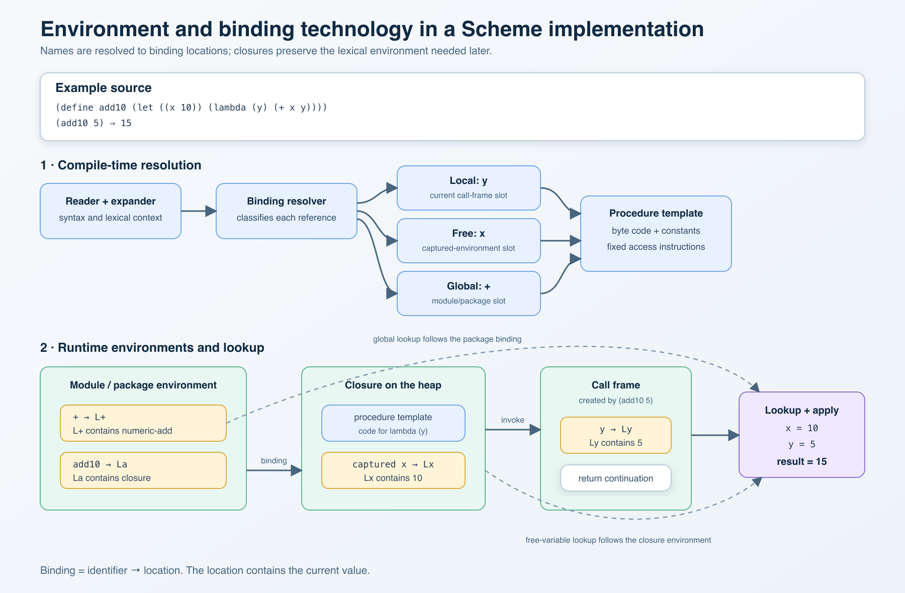

- [Go top](../index.html)
- [Go index](./index.html)

# The Scheme/Scheme48 bindings concept

## General information about bindings

Bindings are essential for handling environmental variables and values in programming languages. In general, there are three ways to bind:

1. **Dynamic Binding**

In dynamic binding, the program searches for a variable by looking backward through the call stack (the chain of invoked functions) rather than the code's physical structure.
- **Key Characteristic:** A function can access variables defined in the function that called it. 
- **Why it's rare now:** It makes code unpredictable because a function's behavior can change depending on where it is called from, making bugs hard to track down.

```perl
#!/usr/bin/env perl
use strict;
use warnings;

# 1. Define a package-level (global) variable
our $target = "Global Value";

sub print_target {
    # Looks up the call stack to find what '$target' currently means
    print "Current Value: $target\n";
}

sub run_dynamic_example {
    # 'local' temporarily overrides the global $target on the execution stack.
    # It will remain this way for ANY function called from inside this block.
    local $target = "Dynamic Overridden Value";
    
    print_target(); 
}

# --- Execution ---

print "Before test: ";
print_target(); # Prints "Global Value"

print "Inside test: ";
run_dynamic_example(); # Prints "Dynamic Overridden Value" because of the call stack

print "After test:  ";
print_target(); # Prints "Global Value" (the temporary dynamic override is popped off the stack)

```

2. **Lexical Bindings**

Lexical binding means that a variable's scope is determined entirely by where it is written in the physical source code. When you write a line of code, the compiler or interpreter looks at the surrounding text—the blocks, loops, or functions wrapping that line—to figure out exactly which variable you are pointing to. Because of this, it is also frequently called static scoping. Here is a lexical binding example in Javascript:

```javascript
function makeCounter() {
    let count = 0; // 'count' is bound lexically to makeCounter
    
    return function() {
        count++; // This inner function captures 'count'
        return count;
    };
}

const counter = makeCounter();
console.log(counter()); // 1
console.log(counter()); // 2
```

3. **Shallow vs. Deep Binding**

These terms specifically describe how **dynamic** languages handle variables when you pass a function as an argument to another function.- Deep Binding:

- **Deep Binding:** Captures the variable environment at the moment the function is **passed** as an argument. 
- **Shallow Binding:** Resolves the variable environment at the moment the function is **finally executed**.
 
## The binding concept in Scheme

Scheme dialects use lexical binding. This form of binding is very clean. Here is an example to show the difference between lexical and dynamic binding:

1. **Dynamic Binding in LISP**

```lisp
;; -*- lexical-binding: nil; -*- (Dynamic binding is active)

(defvar target 100) ; 1. A global variable 'target' is created

(defun print-target ()
  "Prints whatever 'target' currently means on the call stack."
  target)

(defun run-dynamic-test ()
  "Creates a local 'target' and then calls print-target."
  (let ((target 200)) ; 2. Temporarily pushes 'target = 200' onto the stack
    (print-target)))  ; 3. Calls the printing function

(run-dynamic-test) 
;; => OUTPUT: 200
```
- **Why this happens:** When print-target executes, it looks at the live call stack. Because it was called from inside run-dynamic-test, it grabs the temporary value 200 currently sitting on top of the stack

2. **Lexical Binding in LISP**

```lisp
;; -*- lexical-binding: t; -*- (Lexical binding is active)

(defvar target 100) ; 1. A global variable 'target' is created

(defun print-target ()
  "Prints 'target' based on where this function was typed."
  target)

(defun run-lexical-test ()
  "Creates a local 'target' and then calls print-target."
  (let ((target 200)) 
    (print-target)))  

(run-lexical-test) 
;; => OUTPUT: 100

``` 
- **Why this happens:** When print-target executes, it looks at its physical surroundings in the text editor. It sees that it is written in the global outer space, completely separate from run-lexical-test. It completely ignores the let statement and grabs the global 100.
  
## Scheme and the lexical environment

### Here is a picture of a typical Scheme environment / Scheme 48 uses the same mechanisms

**NOTE** The code used is from one of my projects (**SECD machine** extended) written in **Racket** 

[The SECD Suite project](https://github.com/hglabplh-tech/SECD-Machine-Compiler-Suite)

**Here is a first code snippet showing the lookup of a dynamic environment binding:**

```scheme

;; Lookup of a binding -> lookup in the following order
;;  - Actual Environment
;;  - The last environment before the actual and its parent are searched up to the top-level 
;; frame (a frame is one unit on the dump)


(define lookup-environment
  (lambda (environment dump variable)
    (let* ([act-val (lookup-act-environment environment variable)])
      (cond ((not (empty? act-val)) act-val)
            ((not (empty? dump))  (env-lookup-helper dump variable))
            (else act-val)))))

;; Helper functions for lookup
(define env-lookup-helper (lambda (dump variable)
                            (let* ([env (frame-environment (first dump))]
                                   [binding (lookup-act-environment env variable)])                            
                              (if (not (empty? binding))
                                  binding
                                  (if (empty? (rest dump))
                                      empty
                                      (env-lookup-helper (rest dump) variable)
                                      )                            
                                  ))))
```

**Here, the runtime search for a binding is shown.
The more interesting part is how the binding happens when compiling the code versus when it happens dynamically. For lexical binding, the way a variable is bound is determined by walking through the source when compiling it.
Here is a Scheme example of lexical binding logic:**
```racket
#lang racket

(require racket/match)

;; ============================================================
;; SOURCE ABSTRACT SYNTAX
;; ============================================================

(struct program (statements) #:transparent)
(struct variable-declaration (name expression) #:transparent)
(struct function-declaration (name body) #:transparent)
(struct function-call (name arguments) #:transparent)
(struct print-statement (format-expression arguments) #:transparent)
(struct if-statement (condition then-block else-block) #:transparent)
(struct comparison (operator left right) #:transparent)
(struct integer-expression (value) #:transparent)
(struct string-expression (value) #:transparent)
(struct variable-expression (name) #:transparent)

;; ============================================================
;; LEXICALLY RESOLVED / COMPILED ABSTRACT SYNTAX
;;
;; A lexical address identifies a binding without searching by name:
;;   depth = number of lexical parent links
;;   slot  = position inside the selected environment frame
;; ============================================================

(struct lexical-address (depth slot name) #:transparent)
(struct compiled-program (global-frame-size statements) #:transparent)
(struct compiled-block (frame-size statements) #:transparent)
(struct compiled-variable-declaration (address expression) #:transparent)
(struct compiled-function-declaration
  (address function-frame-size body)
  #:transparent)
(struct compiled-function-call (address arguments) #:transparent)
(struct compiled-print-statement (format-expression arguments) #:transparent)
(struct compiled-if-statement (condition then-block else-block) #:transparent)
(struct compiled-comparison (operator left right) #:transparent)
(struct compiled-integer (value) #:transparent)
(struct compiled-string (value) #:transparent)
(struct compiled-variable (address) #:transparent)

;; ============================================================
;; TOKENIZER
;; ============================================================

(define token-pattern
  #px"\"(?:\\\\.|[^\"])*\"|<=|>=|==|!=|<-|<|>|[A-Za-z_][A-Za-z0-9_]*|-?[0-9]+|[(),;]")

(define (tokenize source)
  (regexp-match* token-pattern source))

;; ============================================================
;; PARSER
;;
;; program       := statement (";" statement)* ";"?
;; statement     := declaration | call | print | if
;; declaration   := "dcl" identifier "<-" expression
;;                | "dcl" "fun"? identifier block
;; call          := identifier "(" arguments? ")"
;; print         := "print" expression ("," expression)*
;; if            := "if" condition "then" block "else" block
;; condition     := expression comparison-operator expression
;; block         := "(" statement (";" statement)* ";"? ")"
;; expression    := integer | string | identifier
;; comparison-op := "==" | "!=" | "<" | "<=" | ">" | ">="
;; ============================================================

(define (parse source)
  (define tokens (list->vector (tokenize source)))
  (define position 0)

  (define (finished?)
    (= position (vector-length tokens)))

  (define (peek)
    (and (not (finished?))
         (vector-ref tokens position)))

  (define (take!)
    (when (finished?)
      (error 'parse "unexpected end of input"))
    (begin0
      (vector-ref tokens position)
      (set! position (add1 position))))

  (define (accept! expected)
    (and (equal? (peek) expected)
         (begin (take!) #t)))

  (define (expect! expected)
    (unless (accept! expected)
      (error 'parse "expected ~a, found ~a" expected (peek))))

  (define reserved-words
    '("dcl" "fun" "print" "if" "then" "else"))

  (define (identifier-token? token)
    (and token
         (regexp-match? #px"^[A-Za-z_][A-Za-z0-9_]*$" token)
         (not (member token reserved-words))))

  (define (take-identifier!)
    (let ([token (take!)])
      (unless (identifier-token? token)
        (error 'parse "expected identifier, found ~a" token))
      (string->symbol token)))

  (define (string-token? token)
    (and token
         (>= (string-length token) 2)
         (char=? (string-ref token 0) #\")))

  (define (decode-string token)
    (with-input-from-string token read))

  (define (parse-expression)
    (let ([token (take!)])
      (cond
        [(regexp-match? #px"^-?[0-9]+$" token)
         (integer-expression (string->number token))]
        [(string-token? token)
         (string-expression (decode-string token))]
        [(identifier-token? token)
         (variable-expression (string->symbol token))]
        [else
         (error 'parse "invalid expression: ~a" token)])))

  (define comparison-operators
    '("==" "!=" "<" "<=" ">" ">="))

  (define (parse-condition)
    (let* ([left (parse-expression)]
           [operator (take!)])
      (unless (member operator comparison-operators)
        (error 'parse "expected comparison operator, found ~a" operator))
      (comparison operator left (parse-expression))))

  (define (parse-arguments)
    (expect! "(")
    (cond
      [(accept! ")") '()]
      [else
       (let loop ([result (list (parse-expression))])
         (if (accept! ",")
             (loop (append result (list (parse-expression))))
             (begin
               (expect! ")")
               result)))]))

  (define (parse-call)
    (let ([name (take-identifier!)])
      (function-call name (parse-arguments))))

  (define (parse-print)
    (expect! "print")
    (let ([format-expression (parse-expression)])
      (let loop ([arguments '()])
        (if (accept! ",")
            (loop (append arguments (list (parse-expression))))
            (print-statement format-expression arguments)))))

  (define (parse-block)
    (expect! "(")
    (let loop ([result '()])
      (cond
        [(accept! ")") result]
        [else
         (let ([statement (parse-statement)])
           (accept! ";")
           (loop (append result (list statement))))])))

  (define (parse-if)
    (expect! "if")
    (let ([condition (parse-condition)])
      (expect! "then")
      (let ([then-block (parse-block)])
        (expect! "else")
        (if-statement condition then-block (parse-block)))))

  (define (parse-declaration)
    (expect! "dcl")
    (let ([explicit-function? (accept! "fun")])
      (let ([name (take-identifier!)])
        (cond
          [explicit-function?
           (function-declaration name (parse-block))]
          [(accept! "<-")
           (variable-declaration name (parse-expression))]
          [(equal? (peek) "(")
           (function-declaration name (parse-block))]
          [else
           (error 'parse "invalid declaration for ~a" name)]))))

  (define (parse-statement)
    (cond
      [(equal? (peek) "dcl") (parse-declaration)]
      [(equal? (peek) "print") (parse-print)]
      [(equal? (peek) "if") (parse-if)]
      [(identifier-token? (peek)) (parse-call)]
      [else (error 'parse "unexpected token: ~a" (peek))]))

  (let loop ([result '()])
    (if (finished?)
        (program result)
        (let ([statement (parse-statement)])
          (accept! ";")
          (loop (append result (list statement)))))))

;; ============================================================
;; COMPILE-TIME LEXICAL SCOPING
;; ============================================================

;; A compiler scope maps each declared name to a frame slot.
(struct compiler-scope (bindings next-slot) #:mutable #:transparent)

(define (make-compiler-scope)
  (compiler-scope (make-hasheq) 0))

(define (declare-compile-time-binding! scope name)
  (when (hash-has-key? (compiler-scope-bindings scope) name)
    (error 'compile
           "duplicate declaration in the same lexical scope: ~a"
           name))
  (let ([slot (compiler-scope-next-slot scope)])
    (hash-set! (compiler-scope-bindings scope) name slot)
    (set-compiler-scope-next-slot! scope (add1 slot))
    (lexical-address 0 slot name)))

;; Scopes are ordered nearest-to-farthest.  The compiler performs this
;; name search once and writes the resulting depth and slot into the code.
(define (resolve-compile-time-binding scopes name)
  (let loop ([remaining scopes]
             [depth 0])
    (cond
      [(empty? remaining)
       (error 'compile "unbound identifier: ~a" name)]
      [(hash-has-key?
        (compiler-scope-bindings (first remaining))
        name)
       (lexical-address
        depth
        (hash-ref
         (compiler-scope-bindings (first remaining))
         name)
        name)]
      [else
       (loop (rest remaining) (add1 depth))])))

(define (compile-expression expression scopes)
  (match expression
    [(integer-expression value)
     (compiled-integer value)]
    [(string-expression value)
     (compiled-string value)]
    [(variable-expression name)
     (compiled-variable
      (resolve-compile-time-binding scopes name))]))

(define (compile-condition condition scopes)
  (match condition
    [(comparison operator left right)
     (compiled-comparison
      operator
      (compile-expression left scopes)
      (compile-expression right scopes))]))

(define (compile-block statements outer-scopes)
  (let ([block-scope (make-compiler-scope)])
    (let ([compiled-statements
           (compile-statements statements
                               (cons block-scope outer-scopes))])
      (compiled-block
       (compiler-scope-next-slot block-scope)
       compiled-statements))))

(define (compile-statement statement scopes)
  (match statement
    [(variable-declaration name initializer)
     ;; Resolve the initializer before adding the new name.  Therefore
     ;; "dcl x <- x" sees an outer x rather than an uninitialized self.
     (let ([compiled-initializer
            (compile-expression initializer scopes)]
           [address
            (declare-compile-time-binding! (first scopes) name)])
       (compiled-variable-declaration address compiled-initializer))]

    [(function-declaration name body)
     ;; Declare first so that the function can recursively call itself.
     (let* ([address
             (declare-compile-time-binding! (first scopes) name)]
            [function-scope (make-compiler-scope)]
            [compiled-body
             (compile-statements body (cons function-scope scopes))])
       (compiled-function-declaration
        address
        (compiler-scope-next-slot function-scope)
        compiled-body))]

    [(function-call name arguments)
     (compiled-function-call
      (resolve-compile-time-binding scopes name)
      (map (lambda (argument)
             (compile-expression argument scopes))
           arguments))]

    [(print-statement format-expression arguments)
     (compiled-print-statement
      (compile-expression format-expression scopes)
      (map (lambda (argument)
             (compile-expression argument scopes))
           arguments))]

    [(if-statement condition then-block else-block)
     (compiled-if-statement
      (compile-condition condition scopes)
      (compile-block then-block scopes)
      (compile-block else-block scopes))]))

(define (compile-statements statements scopes)
  ;; Compilation is sequential, so a reference can see earlier declarations
  ;; in the same scope.  A function can also see its own binding.
  (map (lambda (statement)
         (compile-statement statement scopes))
       statements))

(define (compile-program source-program)
  (let ([global-scope (make-compiler-scope)])
    (let ([compiled-statements
           (compile-statements
            (program-statements source-program)
            (list global-scope))])
      (compiled-program
       (compiler-scope-next-slot global-scope)
       compiled-statements))))

;; ============================================================
;; RUNTIME LEXICAL ENVIRONMENTS
;; ============================================================

;; Every runtime frame has fixed slots and one lexical parent.
(struct runtime-frame (slots lexical-parent) #:transparent)

;; A closure captures the frame active at its declaration.
(struct closure
  (function-frame-size body definition-environment)
  #:transparent)

(define uninitialized (gensym 'uninitialized))

(define (make-runtime-frame size [parent #f])
  (runtime-frame
   (build-vector size (lambda ignored (box uninitialized)))
   parent))

(define (follow-lexical-parents environment depth)
  (cond
    [(zero? depth) environment]
    [(not environment)
     (error 'runtime "broken lexical address: missing parent frame")]
    [else
     (follow-lexical-parents
      (runtime-frame-lexical-parent environment)
      (sub1 depth))]))

;; Runtime lookup performs no name search.  It follows a known number of
;; lexical-parent links and reads a known slot.
(define (lexical-location environment address)
  (let* ([target-frame
          (follow-lexical-parents
           environment
           (lexical-address-depth address))]
         [slot (lexical-address-slot address)])
    (when (or (< slot 0)
              (>= slot (vector-length
                        (runtime-frame-slots target-frame))))
      (error 'runtime "invalid lexical slot: ~a" slot))
    (vector-ref (runtime-frame-slots target-frame) slot)))

(define (lexical-reference environment address)
  (let ([value (unbox (lexical-location environment address))])
    (when (eq? value uninitialized)
      (error 'runtime
             "binding used before initialization: ~a"
             (lexical-address-name address)))
    value))

(define (lexical-initialize! environment address value)
  (let ([location (lexical-location environment address)])
    (unless (eq? (unbox location) uninitialized)
      (error 'runtime
             "binding initialized more than once: ~a"
             (lexical-address-name address)))
    (set-box! location value)))

;; Assignment is provided for completeness.  It changes an existing location;
;; it does not create or redirect a binding.
(define (lexical-assign! environment address value)
  (set-box! (lexical-location environment address) value))

;; ============================================================
;; RUNTIME EVALUATION
;; ============================================================

(define (evaluate-compiled-expression expression environment)
  (match expression
    [(compiled-integer value) value]
    [(compiled-string value) value]
    [(compiled-variable address)
     (lexical-reference environment address)]))

(define (evaluate-compiled-comparison condition environment)
  (match condition
    [(compiled-comparison operator left-expression right-expression)
     (let* ([left
             (evaluate-compiled-expression left-expression environment)]
            [right
             (evaluate-compiled-expression right-expression environment)])
       (cond
         [(equal? operator "==") (equal? left right)]
         [(equal? operator "!=") (not (equal? left right))]
         [else
          (unless (and (exact-integer? left) (exact-integer? right))
            (error 'comparison
                   "~a requires integer operands, received ~e and ~e"
                   operator left right))
          (cond
            [(equal? operator "<") (< left right)]
            [(equal? operator "<=") (<= left right)]
            [(equal? operator ">") (> left right)]
            [(equal? operator ">=") (>= left right)]
            [else (error 'comparison "unknown operator: ~a" operator)])]))]))

(define (format-with-placeholders format-string values)
  (for/fold ([result format-string])
            ([value (in-list values)])
    (unless (regexp-match? #rx"%(d|s)" result)
      (error 'print "too many values for format string: ~a" format-string))
    (regexp-replace
     #rx"%(d|s)"
     result
     (lambda ignored (format "~a" value)))))

(define (execute-compiled-block! block parent-environment)
  (let ([block-environment
         (make-runtime-frame
          (compiled-block-frame-size block)
          parent-environment)])
    (execute-compiled-statements!
     (compiled-block-statements block)
     block-environment)))

(define (execute-compiled-call! statement caller-environment)
  (match statement
    [(compiled-function-call address arguments)
     (let ([argument-values
            (map (lambda (argument)
                   (evaluate-compiled-expression
                    argument caller-environment))
                 arguments)]
           [function
            (lexical-reference caller-environment address)])
       (unless (closure? function)
         (error 'function-call
                "~a is not a function"
                (lexical-address-name address)))
       (unless (empty? argument-values)
         (error 'function-call "example functions accept no arguments"))

       ;; This is the essential lexical-scoping operation.  The new call
       ;; frame points to the closure's definition environment, not to the
       ;; caller's frame or a caller dump.
       (let ([function-environment
              (make-runtime-frame
               (closure-function-frame-size function)
               (closure-definition-environment function))])
         (execute-compiled-statements!
          (closure-body function)
          function-environment)))]))

(define (execute-compiled-statement! statement environment)
  (match statement
    [(compiled-variable-declaration address initializer)
     (lexical-initialize!
      environment address
      (evaluate-compiled-expression initializer environment))]

    [(compiled-function-declaration address frame-size body)
     (lexical-initialize!
      environment address
      (closure frame-size body environment))]

    [(compiled-function-call _ _)
     (execute-compiled-call! statement environment)]

    [(compiled-print-statement format-expression argument-expressions)
     (let* ([format-string
             (evaluate-compiled-expression format-expression environment)]
            [values
             (map (lambda (argument)
                    (evaluate-compiled-expression argument environment))
                  argument-expressions)])
       (unless (string? format-string)
         (error 'print "first expression must produce a string"))
       (displayln (format-with-placeholders format-string values)))]

    [(compiled-if-statement condition then-block else-block)
     (if (evaluate-compiled-comparison condition environment)
         (execute-compiled-block! then-block environment)
         (execute-compiled-block! else-block environment))]))

(define (execute-compiled-statements! statements environment)
  (for-each
   (lambda (statement)
     (execute-compiled-statement! statement environment))
   statements))

(define (execute-compiled-program! code)
  (let ([global-environment
         (make-runtime-frame
          (compiled-program-global-frame-size code))])
    (execute-compiled-statements!
     (compiled-program-statements code)
     global-environment)
    global-environment))

;; ============================================================
;; EXECUTABLE EXAMPLE
;; ============================================================

(define source
  (string-append
   "dcl a <- 5; "
   "dcl b <- 7; "
   "dcl fun_print (print \"var a: %d  var b: %d\", a, b);"
   "dcl fun test ("
   "  dcl a <- 9; "
   "  if a == 9 then ("
   "    print \"condition true; inner a = %d\", a; "
   "    fun_print()"
   "  ) else ("
   "    print \"condition false; a = %d\", a"
   "  ); "
   "  print \"after if; inner a = %d\", a"
   "); "
   "test(); "
   "fun_print(); "
   "if a < b then ("
   "  print \"top-level condition true: a = %d, b = %d\", a, b"
   ") else ("
   "  print \"top-level condition false: a = %d, b = %d\", a, b"
   ")"))

(define source-tree (parse source))
(define compiled-code (compile-program source-tree))

(displayln "Lexically resolved program:")
(pretty-print compiled-code)
(displayln "\nProgram output:")
(void (execute-compiled-program! compiled-code))

```
**The output in DrRacket is ->**
```text
Lexically resolved program:
(compiled-program
 4
 (list
  (compiled-variable-declaration (lexical-address 0 0 'a) (compiled-integer 5))
  (compiled-variable-declaration (lexical-address 0 1 'b) (compiled-integer 7))
  (compiled-function-declaration
   (lexical-address 0 2 'fun_print)
   0
   (list
    (compiled-print-statement
     (compiled-string "var a: %d  var b: %d")
     (list
      (compiled-variable (lexical-address 1 0 'a))
      (compiled-variable (lexical-address 1 1 'b))))))
  (compiled-function-declaration
   (lexical-address 0 3 'test)
   1
   (list
    (compiled-variable-declaration
     (lexical-address 0 0 'a)
     (compiled-integer 9))
    (compiled-if-statement
     (compiled-comparison
      "=="
      (compiled-variable (lexical-address 0 0 'a))
      (compiled-integer 9))
     (compiled-block
      0
      (list
       (compiled-print-statement
        (compiled-string "condition true; inner a = %d")
        (list (compiled-variable (lexical-address 1 0 'a))))
       (compiled-function-call (lexical-address 2 2 'fun_print) '())))
     (compiled-block
      0
      (list
       (compiled-print-statement
        (compiled-string "condition false; a = %d")
        (list (compiled-variable (lexical-address 1 0 'a)))))))
    (compiled-print-statement
     (compiled-string "after if; inner a = %d")
     (list (compiled-variable (lexical-address 0 0 'a))))))
  (compiled-function-call (lexical-address 0 3 'test) '())
  (compiled-function-call (lexical-address 0 2 'fun_print) '())
  (compiled-if-statement
   (compiled-comparison
    "<"
    (compiled-variable (lexical-address 0 0 'a))
    (compiled-variable (lexical-address 0 1 'b)))
   (compiled-block
    0
    (list
     (compiled-print-statement
      (compiled-string "top-level condition true: a = %d, b = %d")
      (list
       (compiled-variable (lexical-address 1 0 'a))
       (compiled-variable (lexical-address 1 1 'b))))))
   (compiled-block
    0
    (list
     (compiled-print-statement
      (compiled-string "top-level condition false: a = %d, b = %d")
      (list
       (compiled-variable (lexical-address 1 0 'a))
       (compiled-variable (lexical-address 1 1 'b)))))))))

Program output:
condition true; inner a = 9
var a: 5  var b: 7
after if; inner a = 9
var a: 5  var b: 7
top-level condition true: a = 5, b = 7
```



**NOTE**: Copyright
- Harald Glab-Plhak
- Computer Science since 1992
- &copy; Harald Glab-Plhak 2026

