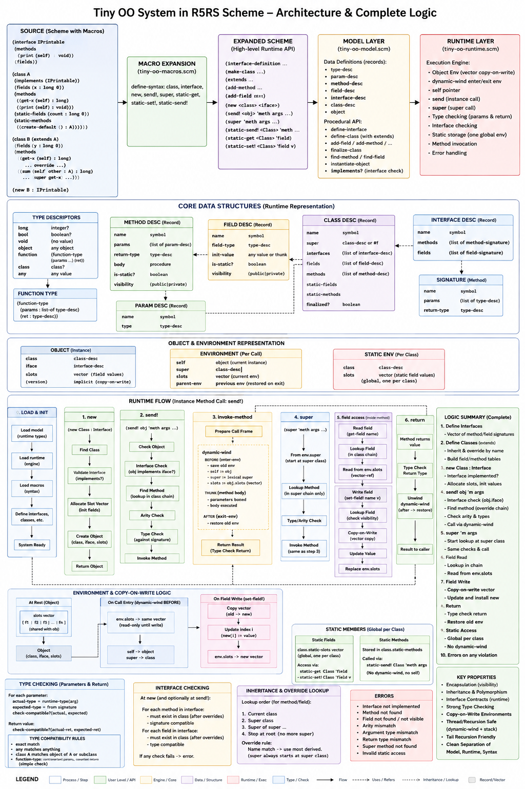

###### [Goto top](../index.html)
###### [Goto index](./index.html)
###### [Go back](./traveling-through-comp-scienceP2.html)

# The idea of object-oriented programming

## My coding / designing thoughts Part III - Object-Oriented Part

## Under the hood

- [Load the object model environment](./oo-scm-markdown/load-tiny-oo.html)
- [The object model environment macro interface](./oo-scm-markdown/tiny-oo-macros.html)
- [The object model environment model](./oo-scm-markdown/tiny-oo-model.html)
- [The object model environment runtime](./oo-scm-markdown/tiny-oo-runtime.html)

#### Here the whole thing again in a concept graphic

- Harald Glab-Plhak
- Computer Science since 1992

- &copy; Harald Glab-Plhak (2026)