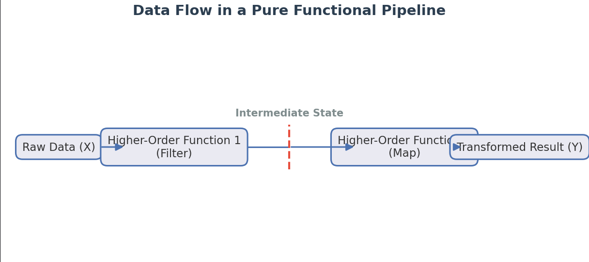

###### [Goto top](../index.html)
###### [Goto index](./index.html)
###### [Go back](./travelling-through-comp-scienceP1.html)

# The idea of functional programming 

## My coding / designing thoughts Part II - Functional Part

### First steps - a long time ago

#### Step one - the introduction of the lambda calculus

The history of functional programming and design started in the 1930's (no joke). At that time, a mathematical Genius, Alonzo Church, introduced the theory of the lambda calculus. For short, it is:
```text
  Conceptualized computation using mathematical abstraction and variable binding.
```

At the time, it was not possible to realize anything from it, and I don't think he was aware of the influence his theory would have on modern computation and programming languages, or that a complete paradigm of design and programming would be invented based on that theory.

##### How data are processed in a functional way:
<!--
Source - https://stackoverflow.com/a/41912122
Posted by Philipp Schwarz, modified by community. See post 'Timeline' for change history
Retrieved 2026-08-24, License - CC BY-SA 4.0
-->




#### Pioneering (1950s–1960s) - The introduction of a new computing language (LISP)

John McCarthy had the idea to create a programming language out of this theory, so LISP was invented. LISP stands for  LISt Processor or LISt processing. Here is a little code snippet of the first LISP version (the Fibonacci):

```lisp
(label fib
  (lambda (n)
    (cond ((eq n 0) 0)
          ((eq n 1) 1)
          (t (+ (fib (- n 1)) (fib (- n 2)))))))
```
and to be a bit more modern here, the same in the widespread version of LISP (Common LISP)

```lisp
(defun fib (n)
  (cond ((= n 0) 0)
        ((= n 1) 1)
        (t (+ (fib (- n 1)) (fib (- n 2))))))

```
Now a function is shown to explain currying in code. Currying is done because, by definition, the functions contain that only one parameter per function is allowed. So the creators had to think about how to define a function with 1..n parameters. The solution was currying.

__**Key Syntax Concepts**__
- lambda: Returns an anonymous function that captures the value of x from its surrounding environment (a lexical closure).
- funcall: Required in Common Lisp to evaluate an anonymous function or a function stored inside a variable.
- setf: Binds the newly generated anonymous function to the variable add-ten.
```lisp
;; Here is how the add function is defined without currying
(defun non-curried-add (x y)  
    (+ x y))

;; Define the curried function generator
(defun curried-add (x)
  (lambda (y)
    (+ x y)))

;; 1. Use it directly to add 5 and 10
(funcall (curried-add 5) 10) ; Returns 15

;; 2. Create a specialized "partial" function
(setf add-ten (curried-add 10))

;; 3. Call the specialized function later
(funcall add-ten 20) ; Returns 30
```
Here, the currying is shown by defining a simple add function with two parameters. In Common LISP and other functional languages like Scheme or Haskell, currying happens under the hood.
To show two other languages here the way of curriing in **Scheme** and **Clojure** :
```scheme
;; Define the curried function
(define ((curried-add x) y)
  (+ x y))

;; 1. Use it directly
((curried-add 5) 10)         ; Returns 15

;; 2. Create a partial function
(define add-ten (curried-add 10))

;; 3. Call it directly like a regular function
(add-ten 20)                 ; Returns 30
```
```clojure
;; Take a normal multi-argument function
(defn add [x y] (+ x y))

;; Instantly create a partial function
(def add-ten (partial add 10))

(add-ten 20) ;; returns 30
```


#### Typing & Purity (1970s–1990s) - Introduce types and introduce purity

In the 1970s to 1990s, the idea was to introduce data types, that is, pure functional behavior, to functional languages. The leading languages here were ML (Meta Language) and Haskell.
Here are two examples one in **Haskell** and one in **ML (Meta Language)** in our case **SML => Standard ML** :
```haskell
-- Define a normal-looking function
add :: Int -> Int -> Int
add x y = x + y

-- 1. Use it directly (looks like a normal call, no commas or parentheses needed)
result = add 5 10      -- Returns 15

-- 2. Create a partial function just by leaving out the second argument
addTen = add 10

-- 3. Call it later
finalResult = addTen 20 -- Returns 30
```
```sml
(* 1. Define a curried add function *)
fun add x y = x + y

(* The compiler infers the type as: fn : int -> int -> int *)


(* 2. Use it directly *)
val result = add 5 10         (* Returns 15 *)


(* 3. Create a partial function by supplying only the first argument *)
val addTen = add 10           (* Returns a function of type: int -> int *)


(* 4. Call the partial function later *)
val finalResult = addTen 20   (* Returns 30 *)
```

Another high-impact idea is purity, which means a pure functional implementation of functionality like I/O (in the examples, standard I/O). Haskell implements a feature called **Monads**. Here is the monadic way of implementing standard I/O:

```haskell
-- A pure function: No I/O allowed here. Given the same input, it always returns the same output.
greetPure :: String -> String
greetPure name = "Hello, " ++ name ++ "!"

-- A monadic I/O function: It returns an action of type 'IO ()'
main :: IO ()
main = do
    putStrLn "What is your name?"
    name <- getLine                    -- Extract the String out of the IO Monad
    let greeting = greetPure name      -- Call the pure function inside the impure block
    putStrLn greeting                  -- Print the result
```   
Other languages, e.g., ML, use the imperative approach directly. This results in a mixture of two paradigms for I/O; use this as an example. Here is an example:

```sml
(* A pure function *)
fun greetPure name = "Hello, " ^ name ^ "!"

(* An impure function that does I/O directly *)
fun main () =
    let
        val _ = print "What is your name?\n"
        val name = valOf (TextIO.inputLine TextIO.stdIn) (* Directly reads from console *)
        val cleanName = String.substring (name, 0, String.size name - 1) (* Remove trailing newline *)
        val greeting = greetPure cleanName
    in
        print (greeting ^ "\n")                         (* Directly prints to console *)
    end
```
But in languages like **ML**, **Clojure** and **Scheme**, you can define monads easily to get a pure functional implementation in the application itself. Here is an example in **Clojure**:
```clojure
;; The abstract for that kind of logic
;; 1. The Monad Context Creator
;; An IO action is represented simply as a 0-argument function (a thunk)
(defn io-return [v]
  (fn [] v))

;; 2. The Monad Binder
;; Sequences two IO actions together without executing them yet
(defn io-bind [io-action f]
  (fn []
    (let [pure-val (io-action)]     ;; Run the first action to get the inner value
      ((f pure-val)))))            ;; Pass it to function f, then run the resulting action

;; 3. The Runner (The Impure Entry Point)
;; Forces the execution of the entire monadic chain
(defn run-io [io-action]
  (io-action))

```

Now a bit more practical

```clojure
;; The implementation in the way of the abstract above
;; A monadic action that prints a string to the console
(defn io-print [s]
  (fn [] 
    (println s)
    nil)) ;; Returns nil inside the monad context

;; A monadic action that reads a line from the console
(def io-read-line
  (fn [] 
    (read-line)))
```
These enhancements introduced new aspects of the functional paradigm and made it more usable in production, where types make it easier to ensure code robustness.

#### Modern (2000s–Present) - The adoption of the functional paradigm in mainstream languages

The functional paradigm is very useful. Especially if functions run in parallel. This is because the functional paradigm has no side effects. Functions take defined arguments and return freshly created values or aggregates rather than manipulating aggregates or values defined in the calling function, procedure, or method. Or globally defined values. Here are some examples of the functional paradigm integration in popular languages:

Example in **Scala**:
```scala
def makeMultiplier(x: Int): Int => Int = {
  y => x * y
}

@main def run() = {
  // Create a specialized function that doubles a number
  val totalDoubler = makeMultiplier(2)
  
  println(totalDoubler(5)) // Output: 10
}
```
Example in **Java Version 8 or higher**:
```java
import java.util.function.Function;

public class Main {
    public static Function<Integer, Integer> makeMultiplier(int x) {
        // x is captured inside the lambda block below
        return (y) -> x * y;
    }

    public static void main(String[] args) {
        // Create a specialized function that doubles a number
        Function<Integer, Integer> totalDoubler = makeMultiplier(2);
        
        System.out.println(totalDoubler.apply(5)); // Output: 10
    }
}
```
Example in **Clojure**:
```clojure
(defn make-multiplier [x]
  (fn [y] (* x y)))

;; Create a specialized function that doubles a number
(def total-doubler (make-multiplier 2))

(println (total-doubler 5)) ; Output: 10
```

```javascript
const makeMultiplier = (x) => {
  return (y) => x * y;
};

// Create a specialized function that doubles a number
const totalDoubler = makeMultiplier(2);

console.log(totalDoubler(5)); // Output: 10
```
Example in **Kotlin**:
```kotlin
fun makeMultiplier(x: Int): (Int) -> Int {
    return { y -> x * y }
}

fun main() {
    // Create a specialized function that doubles a number
    val totalDoubler = makeMultiplier(2)
    
    println(totalDoubler(5)) // Output: 10
}
```
Example in **Python**:
```python
def make_multiplier(x):
    def multiplier(y):
        return x * y
    return multiplier

# Create a specialized function that doubles a number
total_doubler = make_multiplier(2)

print(total_doubler(5)) # Output: 10
```
Example in **Rust**
```rust
// impl Fn(i32) -> i32 means "returns something that implements this function signature"
fn make_multiplier(x: i32) -> impl Fn(i32) -> i32 {
    // The "move" keyword forces the closure to take ownership of 'x'
    move |y| x * y
}

fn main() {
    // Create a specialized function that doubles a number
    let total_doubler = make_multiplier(2);
    
    println!("{}", total_doubler(5)); // Output: 10
}
```
Example in **C++ -> V11 or higher**
```cpp
#include <iostream>
#include <functional>

// std::function<int(int)> defines a function taking an int and returning an int
std::function<int(int)> makeMultiplier(int x) {
    // [x] copies 'x' into the lambda's internal storage
    return [x](int y) {
        return x * y;
    };
}

int main() {
    // Create a specialized function that doubles a number
    auto totalDoubler = makeMultiplier(2);
    
    std::cout << totalDoubler(5) << std::endl; // Output: 10
    return 0;
}
```

The takeaway is that the functional paradigm is very old, like the multi-threading idea. The problem was how to implement the paradigm with limited memory and non-parallel processors with only one core and a low instruction-per-second rate. 

### Now let's look under the hood

One great step in the history was the introduction of the **SECD** machine by Peter Landin. 

#### The history and abstract of the __SECD__ ( __S__ tack __E__ nvironment __C__ ode / __C__ ontrol __D__ ump) machine

Peter Landin was the crucial bridge between abstract mathematics and practical computer science. While Alonzo Church invented lambda calculus as a logic tool and John McCarthy used it loosely to inspire LISP, Landin was the first to realize that lambda calculus could model and decode real-world programming languages.
In the 1960s, Landin introduced several revolutionary concepts that laid the groundwork for modern functional compiler design:

##### 1964 - Landin invented the SECD Machine

- It was the world's first abstract machine (virtual machine) specifically designed to run functional code.
- Instead of mapping functions to mechanical computer hardware, compilers could target this virtual machine.
- It mathematically proved how to handle things like nested variables and environments safely.

##### 1965 - Landin invented the ISWIM and the "Off-Side Rule"

- It was arguably the first language to align perfectly with the core ethos of modern functional programming.
- He introduced the Off-Side Rule, which uses indentation and whitespace to define code blocks. 
- If you have ever written Python, Haskell, or F#, you are using Landin's whitespace logic.

##### Coining "Syntactic Sugar"
Landin coined the phrase "syntactic sugar". He used it to describe user-friendly features in a language's syntax that do not change what the code can do, but make it much easier for humans to read and write. He showed that many complex programming language commands were just "sugar" built on top of basic lambda calculus.

##### Inventing the "Closure"

When figuring out how to make higher-order functions work on physical computers, Landin realized that a function passed around as data needs to remember the variables that surrounded it when it was born. He invented the concept of a closure (a function bundled with references to its surrounding state). Today, closures are vital components of **JavaScript**, **Swift**, and **Rust**, as well as other languages that use the functional paradigm, like **Java**, **Python**, **LISP**, and many others.

**NOTE**: TO BE CONTINUED

- Harald Glab-Plhak
- Computer Science since 1992

- &copy; Harald Glab-Plhak (2026)


