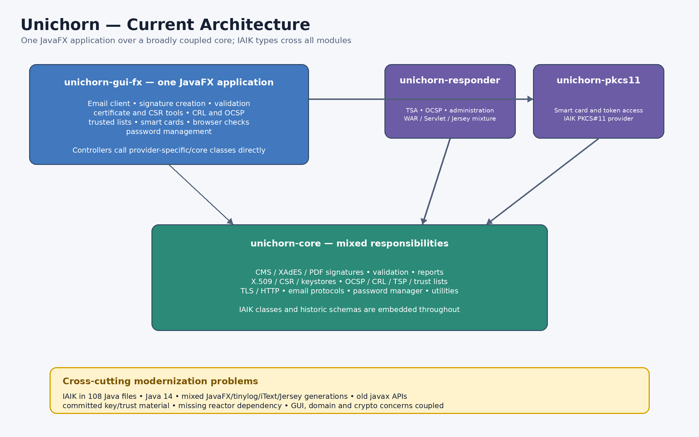
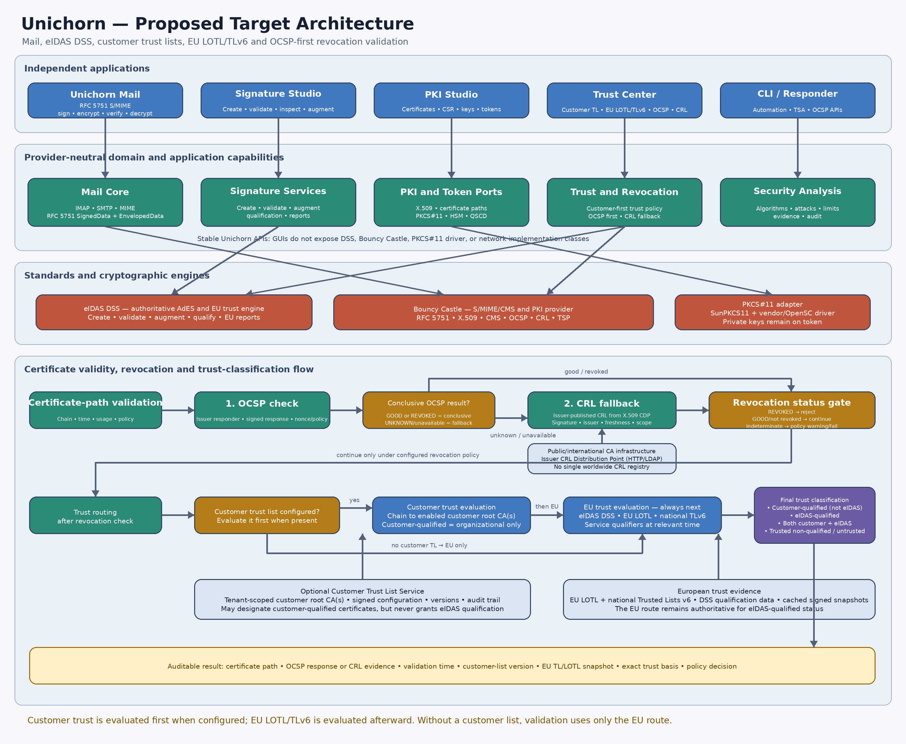
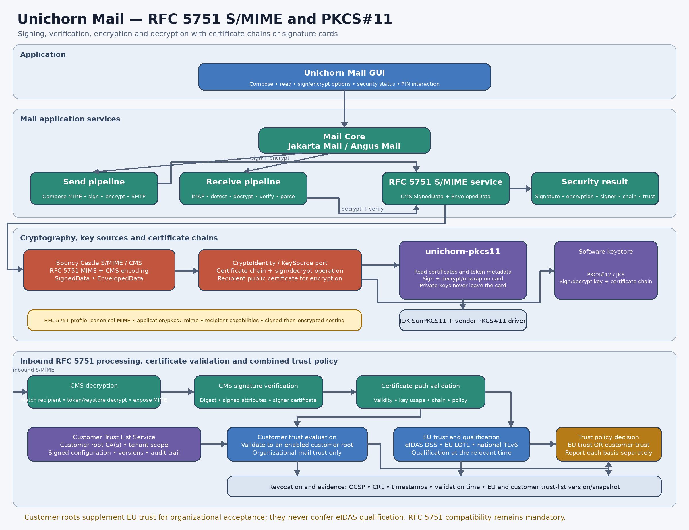

- [Go Top](../index.html)
- [Go back](./index.html)
- [Go Next](./readme.html)

# The project status and the planned target architecture 

## The project AS IS architecture

## The target architecture

## The architecture of the included Mail Client

## First explanation of the reasons for the change

As you can see in the first project diagram, which shows how it looks now, there is no clean separation between features. This creates a clean separation of features, with strict borders between modules, so each module can be extended without changing the others. Maintainability is another reason for the change.

## The new architecture and the advantages

The new architecture improves maintainability, adopts the latest standards, and moves from IAIK to free libraries so everyone can participate.

## The new Mail client

The new mail client is a separate module in the new architecture with a separate GUI. The new Mail Client uses RFC 5751 and can work with self-signed certificates, customer certificate chains, and PKCS-11 to create and read signatures, as well as evaluate them. 

- [Project - flight - plan - future development and design](./flightplan.html)

### Copyright notice

- Harald Glab-Plhak
- Computer Science since 1992
- &copy; Harald Glab-Plhak (2026)