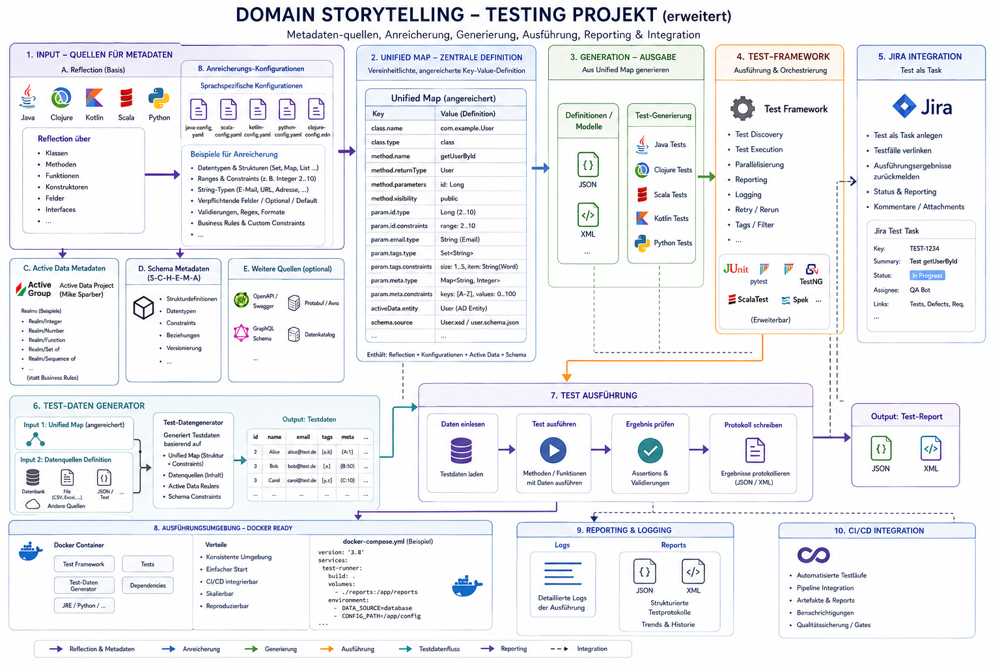
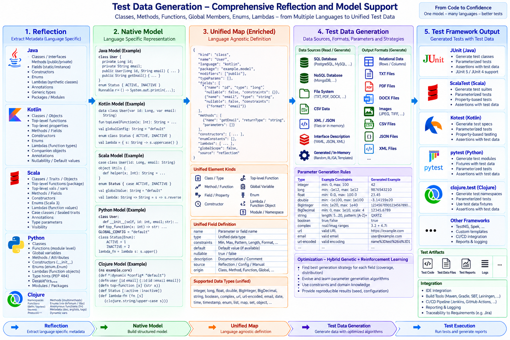

- [Go Top](../index.html)
- [Go Next](./project.html)

# The YATestsEnvironment project : A framework for testing and test data generation

**ABSTRACT:**

Cross-language reflection + metadata → unified test-data generation, Active Data realms, mocking/spying, and artifact/test-data and test-code generation

YATestEnvironment is a mixed Clojure/Java test-engineering project. It brings together reflection utilities, generated test-data pipelines, function spying and mocking, annotation helpers, and early code-generation experiments for Java/Clojure test automation.

You can use the project as a library or as a research/workbench codebase. Some areas are mature enough for automated tests, while others are intentionally marked as foundations or experiments.

### Here is an overview



### The process from reflection to emitted output 



**Additional links:** (API Documentation will be updated next time):

- [Documentation for the YATestEnvironment API](./IE.New.Clojure-reflect)

Here is the Link to the project itself

[The YATestEnvironment project on GitHub](https://github.com/hglabplh-tech/YATestEnvironment)

## Status Legend

- **Available**: implemented and covered by smoke or unit tests in this repository.
- **In progress**: implemented enough to use as a foundation, but the API or behavior may still change.
- **Experimental**: research-oriented code, prototypes, or partial implementations.

## What It Provides

### Available

- Java reflection helpers for classes, constructors, methods, fields, annotations, generic types, modifiers, and type attributes.
- Java annotation inspection and conversion into Clojure data.
- Reflection-to-Clojure-data conversion for class definitions, class bodies, constructors, fields, methods, enum data, record data, lambda-related structures, and switch-related structures.
- Clojure function metadata reading, including Active Data/realm schema extraction.
- Clojure function spying and mocking helpers with metadata tracking and call-flow collection.
- Generated test-data pipeline for Clojure functions and reflected Java methods.
- Payload generation for JSON, XML, CSV, text, printed Clojure data, and compact PDF-style payloads.
- Artifact-oriented test-data Player that reads EDN-style jobs and produces TXT, PDF, DOCX, JPEG, TIFF where supported by ImageIO, and relational EDN rows.
- Artifact storage backends for memory and filesystem output.
- SQLite persistence for generated analysis and generated payloads.
- Custom Java test annotation `@YATest` and test category enum.
- Leiningen, Codox, Javadoc, source classifier, and javadoc classifier project configuration.

### In Progress

- Hook-based Java reflection code generation for JSON, XML, YAML, and Java-like output.
- PostgreSQL artifact storage. The implementation is wired through JDBC, but it requires the PostgreSQL JDBC driver on the runtime classpath and a reachable database.
- Python module inspection through JEP and a bundled Python inspector script.
- Static namespace/code analysis for Clojure namespaces.
- Java special-form analysis for lambdas, switch constructs, enums, and records. Enum and record paths are more concrete; lambda and switch inspection still need hardening.

### Experimental

- Hygienic macro-system experiments inspired by syntax objects and syntax-case style expansion.
- Agda theory notes.
- Research documentation around entropy-oriented testing and broader testing strategy.
- Legacy namespace compatibility between `reflect.java.*`, `reflect.clojure.*`, and newer `reflect.code.java.*` areas.

## Project Layout

- `src/main/clojure/io/github/hglabplh_tech/reflect`: Clojure wrappers and data conversion around Java reflection and code generation.
- `src/main/clojure/io/github/hglabplh_tech/test/suite`: spying, mocking, generated test data, static analysis, and macro experiments.
- `src/main/java/io/github/hglabplh_tech/reflect`: Java reflection utility classes used by the Clojure API.
- `src/main/java/io/github/hglabplh_tech/tests/framework/annots`: custom Java test annotation support.
- `src/main/java/io/github/hglabplh_tech/python`: Java bridge for Python inspection.
- `src/main/resources`: XML schema and Python inspector resources.
- `src/test/clojure` and `src/test/java`: Clojure and Java fixtures plus tests.
- `docs`: testing-method and project design notes.
- `refl_comp_gen`: notes for reflection compilation and generation.

## Requirements

- Java 17.
- Leiningen.
- Clojure dependencies are resolved through `project.clj`.
- Optional: PostgreSQL JDBC driver and a PostgreSQL database when using the PostgreSQL artifact storage backend.
- Optional: a working Python/JEP runtime when using Python inspection.

## Build and Test

Run the Clojure test suite:

```sh
lein test
```

Run the combined alias for Clojure tests, Java test compilation, Codox, and Javadoc generation:

```sh
lein all-tests
```

Build source and javadoc classifiers through the configured Leiningen tasks:

```sh
lein jar
```

## Artifact Test-Data Player

The artifact Player lives under:

```clojure
io.github.hglabplh_tech.test.suite.datagen.artifact.player
```

Example:

```clojure
(require '[io.github.hglabplh_tech.test.suite.datagen.artifact.player :as player])

(player/run!
 {:defaults {:seed 42}
  :storage {:type :file
            :config {:base-dir "target/generated-test-artifacts"}}
  :jobs [{:format :txt
          :count 2
          :hierarchy {:project "atlas"
                      :feature "document-import"
                      :subfeature "plain-text"}}
         {:format :relational
          :count 1
          :hierarchy {:project "customer-service"
                      :class "CustomerRepository"
                      :method "findActiveCustomers"}}]})
```

A sample EDN configuration is available at:

```text
src/test/resources/testdatagen/generator.edn
```

## Generated Analysis Pipeline

The generated test-data pipeline can analyze Clojure namespaces and Java classes, generate parameter samples, render payloads, and persist the result to SQLite:

```clojure
(require '[io.github.hglabplh_tech.test.suite.datagen.pipeline :as pipeline])

(pipeline/analyze-files
 {:namespaces ['some.project.ns]
  :java-classes ["java.lang.String"]
  :db-path "target/test-data/generated-test-data.sqlite"})
```

Java method execution is not automatic in this pipeline yet because it needs a concrete instance or static invocation target.

## Documentation

- `FEATURES.md`: detailed feature inventory with completion status.
- `docs/ClojureTestingFrame.md`: Clojure testing, mocking, spying, and macro notes.
- `docs/Test-Methods.md`: testing-method overview.
- `docs/TestingAgainstEntropy.md`: entropy-oriented testing ideas.
- `docs/ClojureDocu.md`: Clojure documentation notes.
- `refl_comp_gen/README.md`: reflection compilation and generation notes.

## License

YATestEnvironment is licensed under the MIT License.

# Funding & Sponsorship

## Principle

This is a free and open-source learning, research, and engineering project. Funding must not turn access to the software, core documentation, or reference implementations into a paid product.

Sponsorship is welcome when it helps make sustainable work possible. Its intended purpose is modest and practical: reasonable compensation for contributor time, development/test hardware, infrastructure, documentation, testing, security review, research, student/community work and unavoidable project expenses.

The **core reference implementation must remain fully usable without proprietary software, paid APIs, subscriptions or commercial licences**. Paid specialist tools may be used during development or validation, but must never become mandatory runtime dependencies.

## What sponsorship does not buy

Funding does not entitle recipients to exclusive core features, ownership of community work, authority to weaken privacy/security requirements, hidden product placement, or control over technical decisions, merely because money was provided. Sponsors may fund work and participate in open technical discussion; architectural decisions remain subject to normal project review.

## Transparency and proportionality

Where practical, material sponsorship should identify its purpose, such as infrastructure, hardware, contributor time, security review, documentation, or a defined research topic. The intention is **cost and effort support, not profit maximization**.

## Suggested sponsor invitation

> This project is developed as free and open-source software for learning, research and practical enterprise use. Contributions of code, documentation, testing and review are as valuable as financial support.
> 
> Sponsorship is optional. Where organizations or individuals choose to support the project financially, funds are intended primarily to cover project expenses and to give contributors some protected time for maintenance, research, documentation, testing, and implementation.
> 
> Sponsorship does not purchase exclusive features or control over the project. The reference implementation remains free, self-hostable, and accessible to students, researchers, individual developers, and organizations.
> 
> If the project's work is useful to you or your organization and you would like to help sustain it, modest sponsorship is welcome. Just as importantly, we welcome technical collaboration, review, teaching use, research cooperation, and contributions upstream to the open-source projects on which this middleware builds.

## Collaboration before competition

The project prefers integration and upstream collaboration over rebuilding mature open-source infrastructure. Sponsored work may therefore include contributions to dependencies or joint work with their communities.

# Features

YATestEnvironment is a Clojure and Java test automation environment. It combines reflection APIs, function metadata analysis, generated test-data pipelines, spying and mocking utilities, and early code-generation research.

## Status Legend

- **Available**: implemented and exercised by repository tests or smoke tests.
- **In progress**: wired into the project, but still needs API hardening, dependency activation, or broader test coverage.
- **Experimental**: research/prototype code that should not yet be treated as a stable public API.

## Core Purpose

**Available**

- Provides reusable building blocks for automated tests.
- Supports generated test data from Clojure function metadata and Java reflection data.
- Helps inspect Java classes, constructors, methods, fields, annotations, generic types, modifiers, and selected special language forms.
- Provides Clojure-focused spying and mocking utilities for unit-test support.
- Includes documentation for unit testing, functional testing, performance testing, test-driven development, and entropy-oriented test design.

## Build and Runtime

**Available**

- Leiningen project published as `org.clojars.hglabplh/YATestEnvironment`.
- Uses Clojure 1.12.3.
- Compiles Java sources with Java 17 source and target settings.
- Uses Ahead-of-Time compilation for project namespaces.
- Integrates dependencies for Active Data, Active Clojure, Reflections, JSON handling, Cheshire, JUnit Jupiter, Codox, Javadoc, and JEP-based Python inspection.
- Provides aliases for combined Clojure tests, Java test compilation, Codox, and Javadoc workflows.
- Configures source, Java source, test, and resource paths for mixed Clojure/Java development.
- Provides source and Javadoc classifier configuration.

## Java Test Annotations

**Available**

- Defines a custom `@YATest` annotation for test methods and annotation types.
- Marks `@YATest` with JUnit Platform `@Testable`.
- Stores test metadata including category, test name, and implementation date.
- Provides test categories for unit, functional, smoke, black-box, and white-box tests.

## Java Reflection API

**Available**

- Loads classes by canonical class name or existing `Class` object.
- Finds classes from package scanning.
- Retrieves constructors, public constructors, methods, public methods, fields, public fields, subclasses, public subclasses, annotations, interfaces, generic interfaces, superclasses, generic superclasses, enclosing classes, enclosing methods, and enclosing constructors.
- Retrieves members by name where supported.
- Supports annotation lookup by annotation type.
- Exposes direct access to the underlying reflected `Class`.
- Provides Clojure wrappers around Java utility classes for reflection operations.

## Member and Type Inspection

**Available**

- Inspects constructor names, parameter counts, parameter types, generic parameter types, exception types, generic exception types, modifiers, and declaring classes.
- Inspects method names, parameter counts, parameter types, generic parameter types, return types, generic return types, exception types, generic exception types, modifiers, and declaring classes.
- Inspects field names, field types, field modifiers, generic field types, and field annotations.
- Detects type/member characteristics such as annotation, anonymous class, array, enum, interface, local class, member class, primitive type, sealed type, synthetic item, record, varargs, default method, bridge method, enum constant, and synthetic field.
- Converts type and member data into readable Clojure values.

## Annotation Utilities

**Available**

- Reads annotations from classes, constructors, methods, fields, and method/constructor parameters.
- Retrieves annotation return types.
- Converts annotation information into Clojure data.
- Extracts annotation values from annotation methods and fields.
- Includes Java utility classes for lower-level annotation analysis.

## Reflection to Clojure Data

**Available**

- Converts constructors into maps containing object name, general metadata, parameter annotations, annotations, generic exception types, and declaring class.
- Converts methods into maps containing object name, general metadata, generic parameter types, parameter annotations, annotations, generic return type, generic exception types, and declaring class.
- Converts fields into maps containing object name, general metadata, generic type, and annotations.
- Converts classes into maps containing class definition data and class body data.
- Recursively includes constructor, field, method, and nested-class information in class body output.

## Special Java Form Analysis

**Available**

- Analyzes enum classes and exposes enum metadata.
- Analyzes Java records and exposes record component information.

**In progress**

- Captures lambda-related structures such as functional fields, functional method parameters, constructors, and capture fields.
- Captures switch-related structures such as detected switch methods, descriptors, return types, parameter types, opcodes, and counts.
- Special-form coverage is useful for smoke checks and generated structure, but lambda and switch analysis still need more complete semantic coverage.

## Clojure Function Metadata and Active Data Support

**Available**

- Reads function metadata such as namespace, name, file, line, column, argument lists, and schema information.
- Parses Active Data/realm schemas into return-type and argument metadata.
- Extracts argument names, schema types, concrete types, and optional flags.
- Provides helpers for inspecting Active Data realm structures.
- Handles realm forms including scalar, integer range, real range, union, intersection, sequence, set, map, enum, tuple, record, function, delayed, and named realms.

**In progress**

- Some Active Data parsing branches are marked with FIXME comments and need cleanup around edge cases and realm predicate handling.

## Clojure Function Spying

**Available**

- Provides function spying through `prolog` and `spy`.
- Marks target functions with spy metadata before instrumentation.
- Preserves original function execution while adding metadata and runtime recording.
- Captures call-flow information for instrumented functions.
- Captures stack-trace context to identify invocation locations.
- Structures function metadata for profiling and later test-data generation.

## Clojure Function Mocking

**Available**

- Provides metadata-driven function mocking through `prolog`, `mock`, and `restore-orig-funs`.
- Marks target functions with mock metadata before instrumentation.
- Rebinds namespace public vars while keeping original function references for restoration.
- Supports conditional mock rules with `call-cond->`.
- Supports rule matching by return predicate and parameter predicates.
- Includes built-in predicate keys for boolean, byte, char, collection, double, float, int, list, long, map, object, set, typed set, short, string, and vararg values.
- Provides mock actions for returning a value, throwing an exception, or doing nothing.
- Records mocked call flow as function name, argument values, and return value.

## Generated Test-Data Pipeline

**Available**

- Loads Clojure source files and derives their declared namespace symbols.
- Analyzes public Clojure functions using function metadata and schema information.
- Analyzes Java classes and methods through the project reflection API.
- Normalizes Clojure functions and Java methods into a shared generated-test-data model.
- Infers parameter value categories such as boolean, string, integer, number, UUID, symbol, set, map, function, and generic values.
- Generates default sample values when no custom rule is provided.
- Supports generated cases per analyzed function or method.
- Generates payloads per configured output format.
- Can execute generated Clojure function cases and record them through the spy call-flow mechanism.
- Persists generated analyses and payloads to SQLite.

**In progress**

- Java method execution from generated cases is not automatic yet because it needs an instance/static invocation target.

## Configurable Generation

**Available**

- Provides default generation settings with JSON output and three samples per function.
- Reads XML generation configuration.
- Validates XML configuration before use.
- Supports configurable output formats.
- Supports per-function and per-parameter rules.
- Supports parameter type overrides, numeric minimum and maximum values, explicit value lists, and format hints.
- Includes an XSD resource for Java-oriented method/parameter rule structures.
- Reads and validates EDN artifact-generation configuration for Player-based artifact jobs.
- Includes a sample EDN artifact-generation configuration under `src/test/resources/testdatagen/generator.edn`.

## Generated Payload Formats

**Available**

- Generates JSON payloads.
- Generates XML payloads.
- Generates CSV payloads.
- Generates text payloads.
- Generates Clojure string/printed data payloads.
- Includes compact PDF-style payload generation for generated test-case output.
- Generates standalone artifact payloads for TXT, PDF, DOCX, JPEG, TIFF where ImageIO supports it, and relational EDN rows.
- Creates portable DOCX artifacts through JDK ZIP/OOXML generation without introducing a new runtime dependency.

## Artifact Test-Data Player

**Available**

- Provides a `Player` protocol and default `TestDataPlayer` implementation.
- Processes configured jobs by walking jobs and sample sequences.
- Calls format generators through a multimethod-based artifact generator.
- Supports `project/feature/subfeature` and `project/class/method` hierarchy concepts for generated artifact paths.
- Stores artifacts through memory and filesystem storage backends.
- Returns generated artifact references and storage summaries.

**In progress**

- PostgreSQL storage is wired through JDBC and validates schema/table creation, but it requires the PostgreSQL JDBC driver and database configuration at runtime.
- TIFF generation depends on an available `ImageIO` TIFF writer in the runtime environment.

## Persistence

**Available**

- Creates and initializes a SQLite database for generated analysis results.
- Stores analyzed function rows with namespace, function name, source location, return type, and serialized analysis data.
- Stores analyzed parameter rows with position, name, type, and generated values.
- Stores generated test payloads by function, case index, and output format.
- Uses a default database path under `target/test-data/generated-test-data.sqlite`.
- Provides artifact storage through memory and filesystem backends.

**In progress**

- Provides JDBC-backed PostgreSQL artifact storage as an optional runtime feature.

## Class Compilation and Code Generation

**Available**

- Compiles a Java class by canonical name into structured reflection data.
- Searches package paths for a class and compiles the discovered class.
- Defines AST-like data tables for class definitions, constructors, class bodies, and enum definitions.
- Provides a registry of hook points for classes, constructors, methods, fields, enums, records, lambdas, switches, and final emission.
- Includes JSON, XML, YAML, and Java-like generator namespaces.

**In progress**

- The hook-based generator walks compiled class data and dispatches to the active registry.
- The JSON, XML, YAML, and Java-like outputs are useful as generated structural output, but they should still be treated as a foundation rather than a complete source-code generator.
- Some namespace/path compatibility needs consolidation between older and newer reflection/code generation namespaces.

## Static Code Analysis

**In progress**

- Registers namespaces for later reflection.
- Captures namespace interns, publics, and related namespace data.
- Represents namespace reflection data with Active Data records.
- Includes early support for finding public functions from reflected namespace data.

## Python Inspection

**In progress**

- Provides a Clojure wrapper around `InspectPythonCode`.
- Includes a Python inspector resource.
- Depends on JEP/runtime setup and needs more integration tests before being treated as stable.

## Hygienic Macro Experimentation

**Experimental**

- Defines syntax objects with datum, scopes, and source metadata.
- Implements pattern matching and syntax-rule style expansion helpers.
- Supports generated renamings for introduced symbols.
- Provides `syntax-case`, `hgp-syntax-rules`, `defhgp`, and `define-syntax` style forms.
- Includes tests and examples for the macro-system experiment.

## Examples and Test Fixtures

**Available**

- Includes Java fixture classes for interfaces, abstract classes, implementations, annotations, enums, records, lambdas, switch behavior, and application-style examples.
- Includes Clojure fixture namespaces for function metadata, Active Data records, generated data, spying, mocking, and static analysis tests.
- Contains both Java-oriented and Clojure-oriented reflection namespace layouts for compatibility and migration.

## Documentation

**Available**

- `README.md` summarizes purpose, status, setup, and usage examples.
- `docs/ClojureTestingFrame.md` documents Clojure-specific mocking, spying, and macro background.
- `docs/Test-Methods.md` explains test-driven development, unit tests, functional tests, and performance tests.
- `docs/TestingAgainstEntropy.md` explains entropy-driven complexity in testing and motivates generated/statistical/formal test approaches.
- `docs/ClojureDocu.md` and generated documentation configuration support API documentation.
- `refl_comp_gen/README.md` documents reflection compilation and generation notes.

## Project Metadata

**Available**

- Licensed under the MIT License.
- Includes a code of conduct.
- Configured with SCM and deployment metadata for Clojars.
- Includes GitHub Sponsors funding metadata and sponsorship context.


**NOTE:** Copyright statement
- Harald Glab-Plhak
- Computer Science since 1992
- &copy; Harald Glab-Plhak (2024, 2025, 2026)
